# H1实验报告
## 20网安一班 蒙秋蓉 2020212063036 

## 1.调查并记录实验环境的如下信息：
- 当前Linux发行版基本信息
  #### 使用```cat /etc/issue``` 
  - 查看发行版本基本信息显示错误
  
  #### 报错no such file or directory，看了一下发现是自己cat后面没有打空格
  #### 成功：
  - 查看当前Linux发行版本基本信息
  
  
- 当前Linux内核版本信息
  #### 使用```uname -a``` 
  - 查看内核信息
  

### 参考：```https://blog.csdn.net/qq_31278903/article/details/83146031```

## 2.vitualbox安装完Ubuntu之后新添加的网卡如何实现系统开机自动启用和自动获取IP：
- 1.通过命令```ifconfig -a```可以看到所有网卡  
  
- 2.查看ip
  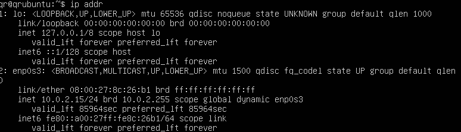
- 3.发现自己还没有```sudo apt install net-tools```
  
- 4.安装net-tools
  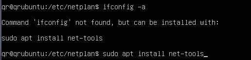
- 5.安装成功
  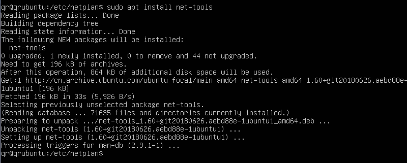
- 6.查看自己的工作网卡ifconfig
  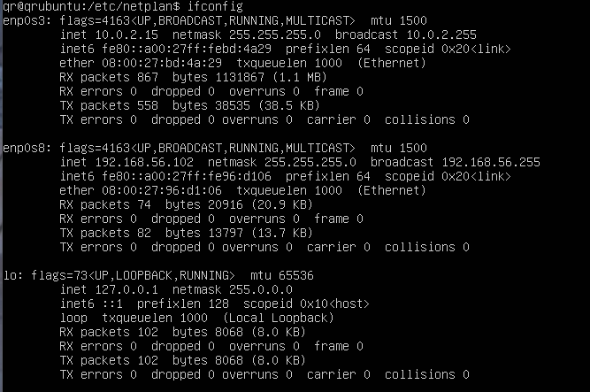
- 7.自己的所有网卡```ifconfig -a```
  
- 8.查看官网动态IP地址分配资料
  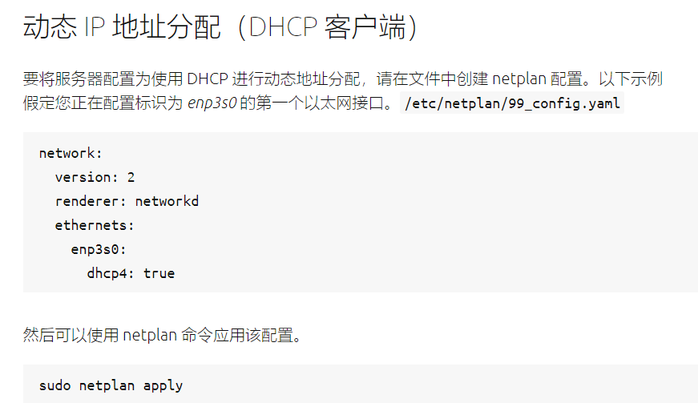
- 9.查看```cat /etc/netplan/00-installer-config.yaml``` 文件，发现是已经可以实现开机自动启用和自动获取IP，退出文件。
  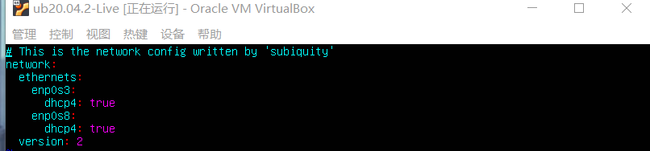
- 10.使用 ```sudo netplan apply``` 即可生效
  
  #### 成功

### 参考链接：
### ①```https://blog.csdn.net/xiongyangg/article/details/110206220```
### ②```https://ubuntu.com/server/docs/network-configuration```

## 如何使用scp在【虚拟机和宿主机之间】、【本机和远程Linux系统之间】传输文件？
- 虚拟机和宿主机之间传输文件：
  - 在虚拟机中创建文件并写入
  
  - 查看文件内容
  
  - 从Linux复制文件到本机，只能从普通用户拷贝，不能从root用户，否则会像上面一样发生permission denied。
  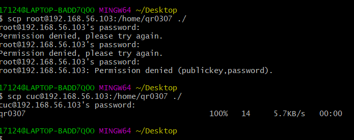拷贝成功！
  - 查看本机桌面，Linux虚拟机里面的qr0307文件已拷贝到桌面
  
  - 打开本机桌面的文件，发现与虚拟机的内容相同
  
  - 从Windows桌面拷贝文件到Linux虚拟机里面，同样步骤，发现内容相同。复制到与之前创建的同名文件不同路径下，原路径是/home/,拷贝到/home/cuc/
  
  

- 本机文件和远程虚拟机（阿里云）之间传输文件
  互相传送密钥文件
  - Linux生成密钥
  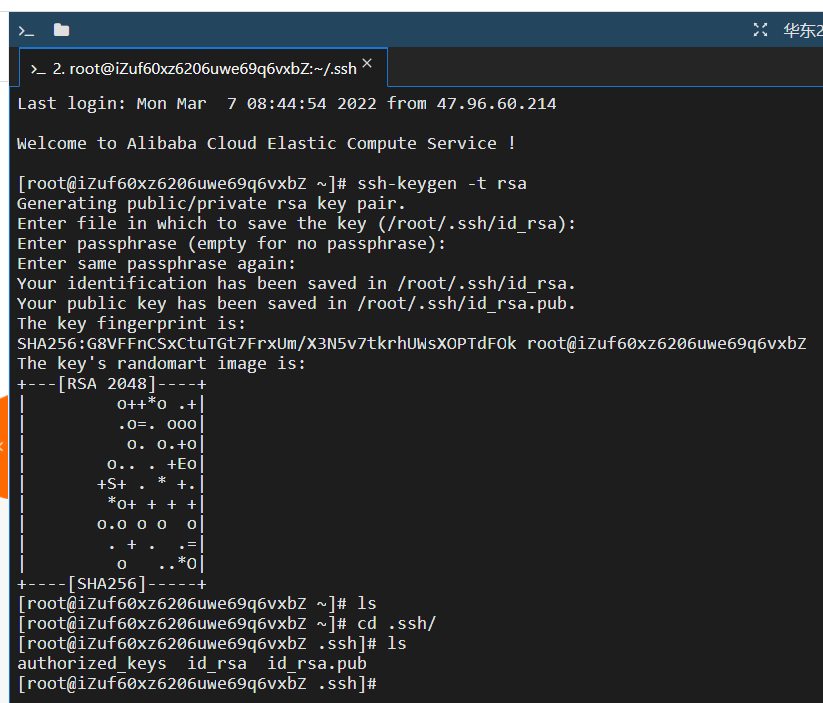
  - Windows生成密钥
  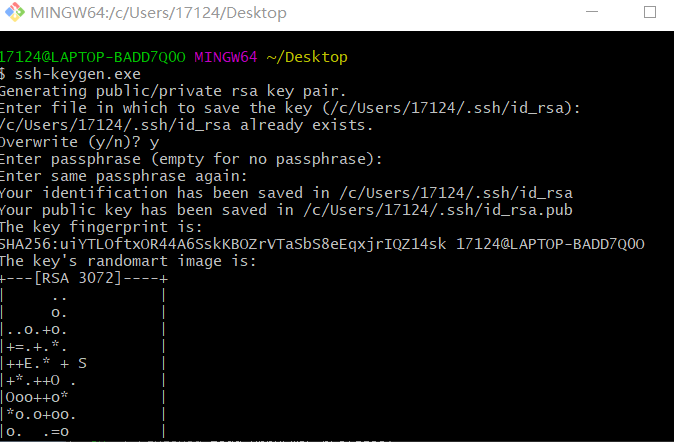
  - 从Windows拷贝id_rsa.pub到远程Linux
  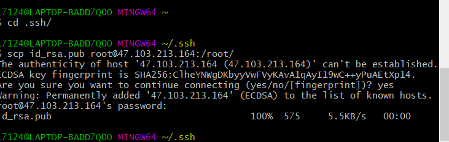
  - 在远程Linux的root路径下发现拷贝过来的文件
  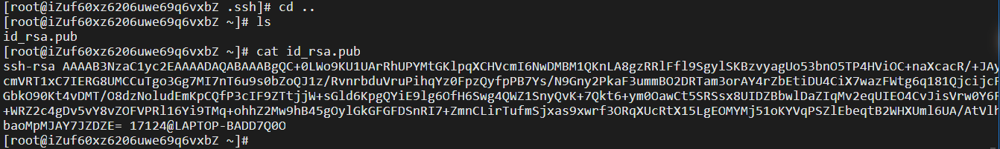
  - scp root@ip（阿里云的）:/root/.ssh/id_rsa.pub ./ 把阿里云的密钥复制到当前位置（就是本机），ls发现在当前目录下。（阿里云密钥拷贝过来的过程忘记截图了、、）
  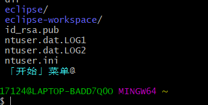
  - 两者文件内容相同，说明文件传输成功
  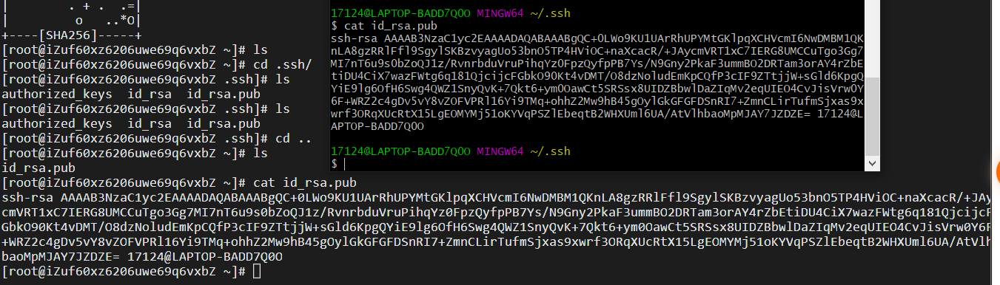

  ### 参考：```https://www.runoob.com/linux/linux-comm-scp.html```

## 如何配置SSH免密登录
- 首先需要在host主机上安装openssh服务器。安装命令如下：```sudo apt-get install openssh-server```
- 首先生成密钥：```ssh-keygen -t rsa``` ,会知道密钥放在/root/.ssh/上（因为我有两台虚拟机，一台名字叫qr一台叫cuc，图为qr虚拟机的操作，cuc同样步骤）
  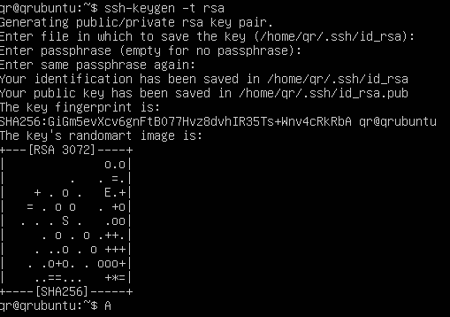
- 把 阿里云的密钥 拷贝到本机上并移动到.ssh上并改名
  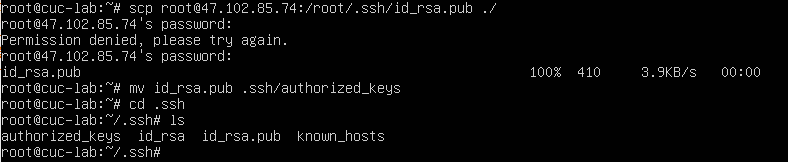
- 把Linux的密钥拷贝到阿里云虚拟机上，并在阿里云平台虚拟机上将拷贝过去的密钥进行移动到.ssh/上并改名
  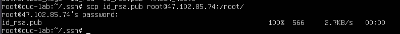
- 将阿里云平台的Linux的密钥移到本地虚拟机的.ssh/路径下并改名
  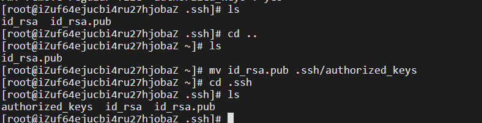
- 互相的/root/.ssh/下有对方的密钥后就可以进行免密登录了
  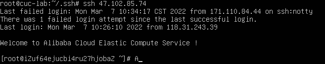
- 但是不能从阿里云ssh登录到我的虚拟机，显示访问超时。
- 根据老师说的“阿里云服务器是「公网服务」，具备「公网 IP」。我们所使用的个人电脑以及个人电脑作为宿主机运行的虚拟机内的 Linux 系统使用的是「私有 IP」地址。从『私有 IP』出发，是可以有条件访问到『公网 IP』上的网络服务的（比如 SSH 就是一种网络服务，网站也是一种网络服务），但是从『公网 IP』出发是无法访问到『私有 IP』地址上的服务的”
- 可以得知应该是不能访问的、、

### 参考：①```https://www.cnblogs.com/hanwen1014/p/9048717.html```
### ②```https://www.bing.com/videos/search?q=%e5%a6%82%e4%bd%95%e9%85%8d%e7%bd%aessh%e5%85%8d%e7%99%bb%e5%bd%95+linux&docid=608014335387465552&mid=1B41E3CD62D014831E901B41E3CD62D014831E90&view=detail&FORM=VIRE```


#### 一些第四题做完后的错误：
- 报错：permission denied
  - 两台本地虚拟机互相拷贝id_rsa.pub到对方机子的home目录下失败
  
  - 我觉得可能是因为两个都是普通用户，所以不能相互传输文件，但是root用户可以传输文件到普通用户，但是只能在/home/下，不能传输到普通用户的/root/下。
  - 因为阿里云平台是root用户，我的是普通用户，所以可以把id_ras.pub拷贝到阿里云平台下。
- 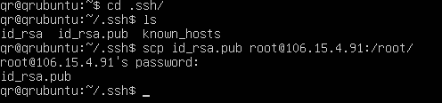
  
- 有时候permission denied是因为输错密码了...

#### 一些第四题做完后的总结：
- ①普通用户不能给root用户发文件（普通用户就是类似cuc，root用户前缀是root），所以如果在做第三问的时候发现permission denied，可以试一下把root@ip改成 cuc（用户名）@ip:/home/，从高一级拷贝普通用户的文件是可以的。
- ②我的虚拟机可以访问阿里云的虚拟机，但阿里云的虚拟机不能访问我的。试了一下ssh 登录我的虚拟机，阿里云那会反应很久，然后就连接超时了。如果想在阿里云虚拟机和本地虚拟机上实现ssh免密登录，可以通过在本地虚拟机操作——1.```scp root@ip（阿里云的）:/root/.ssh/id_rsa.pub ./``` 把阿里云的密钥复制到当前位置（就是本地虚拟机）2.在.ssh/路径下```scp id_rsa.pub root@ip(阿里云的）:/root/``` 把本地的密钥复制到阿里云那边 然后进行下面操作。然后我就可以免密登录阿里云了，阿里云还是不可以登录到本地虚拟机，可能就是上面原因吧、、
- ③可以cmd去```ping＋ip```去检查此ip是否正常使用。