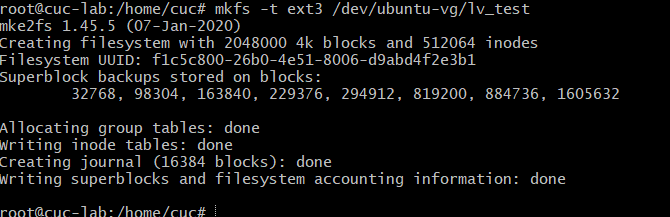

### H3

#### 命令篇：

###### 1.下面的命令用来启动服务：

> ```bash
> $ sudo /etc/init.d/apache2 start
> # 或者
> $ service apache2 start
> ```

实践视频链接：https://asciinema.org/a/bctAn433BGqOt5q2YF1lpiuAJ


###### 2.查看 Systemd 的版本：

> ```bash
> $ systemctl --version
> ```

实践视频链接：https://asciinema.org/a/DKtKX29VtgjrRBqCkqIG23XIT


###### 3.systemctl

`systemctl`是 Systemd 的主命令，用于管理系统。

```bash
# 重启系统
$ sudo systemctl reboot

# 关闭系统，切断电源
$ sudo systemctl poweroff

# CPU停止工作
$ sudo systemctl halt

# 暂停系统
$ sudo systemctl suspend

# 让系统进入冬眠状态
$ sudo systemctl hibernate

# 让系统进入交互式休眠状态
$ sudo systemctl hybrid-sleep

# 启动进入救援状态（单用户状态）
$ sudo systemctl rescue
```

其他命令执行后都会关机。

`sudo systemctl rescue`的情况：


ctrl+D后再输入用户名密码又可登录


###### 4.systemd-analyze

`systemd-analyze`命令用于查看启动耗时。

```bash
# 查看启动耗时
$ systemd-analyze                                                                                       

# 查看每个服务的启动耗时
$ systemd-analyze blame

# 显示瀑布状的启动过程流
$ systemd-analyze critical-chain

# 显示指定服务的启动流
$ systemd-analyze critical-chain atd.service
```

实践视频链接：https://asciinema.org/a/xlzjGcUooFJ4fovzy63fVF9eY


###### 5.hostnamectl

`hostnamectl`命令用于查看当前主机的信息。

```bash
# 显示当前主机的信息
$ hostnamectl

# 设置主机名。
$ sudo hostnamectl set-hostname rhel7
```

实践视频链接：https://asciinema.org/a/uLUqjdtAL9L05iLK5GGUAVRa7


###### 6.localectl

`localectl`命令用于查看本地化设置。

> ```bash
> # 查看本地化设置
> $ localectl
> 
> # 设置本地化参数。
> $ sudo localectl set-locale LANG=en_GB.utf8
> $ sudo localectl set-keymap en_GB
> ```

实践视频链接：https://asciinema.org/a/o1WhXrjLeLU919HKVTWraRVzg


###### 7.timedatectl

`timedatectl`命令用于查看当前时区设置。

> ```bash
> # 查看当前时区设置
> $ timedatectl
> 
> # 显示所有可用的时区
> $ timedatectl list-timezones                                                                                   
> 
> # 设置当前时区
> $ sudo timedatectl set-timezone America/New_York
> $ sudo timedatectl set-time YYYY-MM-DD
> $ sudo timedatectl set-time HH:MM:SS
> ```

执行 `sudo timedatectl set-time YYYY-MM-DD`
`sudo timedatectl set-time HH:MM:SS`时

会报错，因为**启用自动时间同步**

设置`timedatectl set-ntp 0`关闭同步

设置`timedatectl set-ntp 1`开启同步

实践视频链接：https://asciinema.org/a/c70rL1E5SZAfEA0ATHe4SCjPb

参考：[无法设置时间：启用了自动时间同步 代码示例 (iqcode.com)](https://iqcode.com/code/other/failed-to-set-time-automatic-time-synchronization-is-enabled)


###### 8.loginctl

`loginctl`命令用于查看当前登录的用户。

```bash
# 列出当前session
$ loginctl list-sessions

# 列出当前登录用户
$ loginctl list-users

# 列出显示指定用户的信息
$ loginctl show-user ruanyf
```

实践视频链接：https://asciinema.org/a/5M6Fs1XdWPnxoeOeMe6hFTCYl


###### 9.`systemctl list-units`命令可以查看当前系统的所有 Unit 。

> ```bash
> # 列出正在运行的 Unit
> $ systemctl list-units
> 
> # 列出所有Unit，包括没有找到配置文件的或者启动失败的
> $ systemctl list-units --all
> 
> # 列出所有没有运行的 Unit
> $ systemctl list-units --all --state=inactive
> 
> # 列出所有加载失败的 Unit
> $ systemctl list-units --failed
> 
> # 列出所有正在运行的、类型为 service 的 Unit
> $ systemctl list-units --type=service
> ```

实践视频链接：https://asciinema.org/a/tN3JXULAeDGiz6XVfdhhL4XvR


###### 10.`systemctl status`命令用于查看系统状态和单个 Unit 的状态。

> ```bash
> # 显示系统状态
> $ systemctl status
> 
> # 显示单个 Unit 的状态
> $ sysystemctl status bluetooth.service
> 
> # 显示远程主机的某个 Unit 的状态
> $ systemctl -H root@rhel7.example.com status httpd.service
> ```

除了`status`命令，`systemctl`还提供了三个查询状态的简单方法，主要供脚本内部的判断语句使用。

> ```bash
> # 显示某个 Unit 是否正在运行
> $ systemctl is-active application.service
> 
> # 显示某个 Unit 是否处于启动失败状态
> $ systemctl is-failed application.service
> 
> # 显示某个 Unit 服务是否建立了启动链接
> $ systemctl is-enabled application.service
> ```

实践视频链接：https://asciinema.org/a/F1fGl3j2vqR3cONkItKn2j1VZ


###### 11.Unit 管理

对于用户来说，最常用的是下面这些命令，用于启动和停止 Unit（主要是 service）。

> ```bash
> # 立即启动一个服务
> $ sudo systemctl start apache.service
> 
> # 立即停止一个服务
> $ sudo systemctl stop apache.service
> 
> # 重启一个服务
> $ sudo systemctl restart apache.service
> 
> # 杀死一个服务的所有子进程
> $ sudo systemctl kill apache.service
> 
> # 重新加载一个服务的配置文件
> $ sudo systemctl reload apache.service
> 
> # 重载所有修改过的配置文件
> $ sudo systemctl daemon-reload
> 
> # 显示某个 Unit 的所有底层参数
> $ systemctl show httpd.service
> 
> # 显示某个 Unit 的指定属性的值
> $ systemctl show -p CPUShares httpd.service
> 
> # 设置某个 Unit 的指定属性
> $ sudo systemctl set-property httpd.service CPUShares=500
> ```

实践视频链接：https://asciinema.org/a/9FHOnehYcFbPlvcSFI3BkyU9w


###### 12.依赖关系

Unit 之间存在依赖关系：A 依赖于 B，就意味着 Systemd 在启动 A 的时候，同时会去启动 B。

`systemctl list-dependencies`命令列出一个 Unit 的所有依赖。

> ```bash
> $ systemctl list-dependencies nginx.service
> ```

上面命令的输出结果之中，有些依赖是 Target 类型（详见下文），默认不会展开显示。如果要展开 Target，就需要使用`--all`参数。

> ```bash
> $ systemctl list-dependencies --all nginx.service
> ```

实践视频链接：https://asciinema.org/a/5T5Vitl1cdJ3C8O75W0cz6Lj8


###### 13.每一个 Unit 都有一个配置文件，告诉 Systemd 怎么启动这个 Unit 。

Systemd 默认从目录`/etc/systemd/system/`读取配置文件。但是，里面存放的大部分文件都是符号链接，指向目录`/usr/lib/systemd/system/`，真正的配置文件存放在那个目录。

`systemctl enable`命令用于在上面两个目录之间，建立符号链接关系。

> ```bash
> $ sudo systemctl enable clamd@scan.service
> # 等同于
> $ sudo ln -s '/usr/lib/systemd/system/clamd@scan.service' '/etc/systemd/system/multi-user.target.wants/clamd@scan.service'
> ```

如果配置文件里面设置了开机启动，`systemctl enable`命令相当于激活开机启动。

与之对应的，`systemctl disable`命令用于在两个目录之间，撤销符号链接关系，相当于撤销开机启动。

> ```bash
> $ sudo systemctl disable clamd@scan.service
> ```

配置文件的后缀名，就是该 Unit 的种类，比如`sshd.socket`。如果省略，Systemd 默认后缀名为`.service`，所以`sshd`会被理解成`sshd.service`。

实践视频链接：https://asciinema.org/a/PMvyzhC5CREZLGH8j3u48OtaK


###### 14.配置文件的状态

`systemctl list-unit-files`命令用于列出所有配置文件。

> ```bash
> # 列出所有配置文件
> $ systemctl list-unit-files
> 
> # 列出指定类型的配置文件
> $ systemctl list-unit-files --type=service
> ```

这个命令会输出一个列表。

> ```bash
> $ systemctl list-unit-files
> 
> UNIT FILE              STATE
> chronyd.service        enabled
> clamd@.service         static
> clamd@scan.service     disabled
> ```

这个列表显示每个配置文件的状态，一共有四种。

> - enabled：已建立启动链接
> - disabled：没建立启动链接
> - static：该配置文件没有`[Install]`部分（无法执行），只能作为其他配置文件的依赖
> - masked：该配置文件被禁止建立启动链接

注意，从配置文件的状态无法看出，该 Unit 是否正在运行。这必须执行前面提到的`systemctl status`命令。

> ```bash
> $ systemctl status bluetooth.service
> ```

一旦修改配置文件，就要让 SystemD 重新加载配置文件，然后重新启动，否则修改不会生效。

> ```bash
> $ sudo systemctl daemon-reload
> $ sudo systemctl restart httpd.service
> ```

实践视频链接：https://asciinema.org/a/7z2xwlz3VOAhU7KcTGEgLUBff


###### 15.配置文件的格式

配置文件就是普通的文本文件，可以用文本编辑器打开。

`systemctl cat`命令可以查看配置文件的内容。

> ```bash
> $ systemctl cat atd.service
> 
> [Unit]
> Description=ATD daemon
> 
> [Service]
> Type=forking
> ExecStart=/usr/bin/atd
> 
> [Install]
> WantedBy=multi-user.target
> ```

从上面的输出可以看到，配置文件分成几个区块。每个区块的第一行，是用方括号表示的区别名，比如`[Unit]`。注意，配置文件的区块名和字段名，都是大小写敏感的。

每个区块内部是一些等号连接的键值对。

> ```bash
> [Section]
> Directive1=value
> Directive2=value
> 
> . . .
> ```

注意，键值对的等号两侧不能有空格。

实践视频链接：https://asciinema.org/a/kEgLvy9zBhp3fyCAmtUkeLVZ5


###### 16.配置文件的区块

`[Unit]`区块通常是配置文件的第一个区块，用来定义 Unit 的元数据，以及配置与其他 Unit 的关系。它的主要字段如下。

> - `Description`：简短描述
> - `Documentation`：文档地址
> - `Requires`：当前 Unit 依赖的其他 Unit，如果它们没有运行，当前 Unit 会启动失败
> - `Wants`：与当前 Unit 配合的其他 Unit，如果它们没有运行，当前 Unit 不会启动失败
> - `BindsTo`：与`Requires`类似，它指定的 Unit 如果退出，会导致当前 Unit 停止运行
> - `Before`：如果该字段指定的 Unit 也要启动，那么必须在当前 Unit 之后启动
> - `After`：如果该字段指定的 Unit 也要启动，那么必须在当前 Unit 之前启动
> - `Conflicts`：这里指定的 Unit 不能与当前 Unit 同时运行
> - `Condition...`：当前 Unit 运行必须满足的条件，否则不会运行
> - `Assert...`：当前 Unit 运行必须满足的条件，否则会报启动失败

`[Install]`通常是配置文件的最后一个区块，用来定义如何启动，以及是否开机启动。它的主要字段如下。

> - `WantedBy`：它的值是一个或多个 Target，当前 Unit 激活时（enable）符号链接会放入`/etc/systemd/system`目录下面以 Target 名 + `.wants`后缀构成的子目录中
> - `RequiredBy`：它的值是一个或多个 Target，当前 Unit 激活时，符号链接会放入`/etc/systemd/system`目录下面以 Target 名 + `.required`后缀构成的子目录中
> - `Alias`：当前 Unit 可用于启动的别名
> - `Also`：当前 Unit 激活（enable）时，会被同时激活的其他 Unit

`[Service]`区块用来 Service 的配置，只有 Service 类型的 Unit 才有这个区块。它的主要字段如下。

> - `Type`：定义启动时的进程行为。它有以下几种值。
> - `Type=simple`：默认值，执行`ExecStart`指定的命令，启动主进程
> - `Type=forking`：以 fork 方式从父进程创建子进程，创建后父进程会立即退出
> - `Type=oneshot`：一次性进程，Systemd 会等当前服务退出，再继续往下执行
> - `Type=dbus`：当前服务通过D-Bus启动
> - `Type=notify`：当前服务启动完毕，会通知`Systemd`，再继续往下执行
> - `Type=idle`：若有其他任务执行完毕，当前服务才会运行
> - `ExecStart`：启动当前服务的命令
> - `ExecStartPre`：启动当前服务之前执行的命令
> - `ExecStartPost`：启动当前服务之后执行的命令
> - `ExecReload`：重启当前服务时执行的命令
> - `ExecStop`：停止当前服务时执行的命令
> - `ExecStopPost`：停止当其服务之后执行的命令
> - `RestartSec`：自动重启当前服务间隔的秒数
> - `Restart`：定义何种情况 Systemd 会自动重启当前服务，可能的值包括`always`（总是重启）、`on-success`、`on-failure`、`on-abnormal`、`on-abort`、`on-watchdog`
> - `TimeoutSec`：定义 Systemd 停止当前服务之前等待的秒数
> - `Environment`：指定环境变量

Unit 配置文件的完整字段清单，请参考[官方文档](https://www.freedesktop.org/software/systemd/man/systemd.unit.html)。


###### 17.Target

启动计算机的时候，需要启动大量的 Unit。如果每一次启动，都要一一写明本次启动需要哪些 Unit，显然非常不方便。Systemd 的解决方案就是 Target。

简单说，Target 就是一个 Unit 组，包含许多相关的 Unit 。启动某个 Target 的时候，Systemd 就会启动里面所有的 Unit。从这个意义上说，Target 这个概念类似于"状态点"，启动某个 Target 就好比启动到某种状态。

传统的`init`启动模式里面，有 RunLevel 的概念，跟 Target 的作用很类似。不同的是，RunLevel 是互斥的，不可能多个 RunLevel 同时启动，但是多个 Target 可以同时启动。

> ```bash
> # 查看当前系统的所有 Target
> $ systemctl list-unit-files --type=target
> 
> # 查看一个 Target 包含的所有 Unit
> $ systemctl list-dependencies multi-user.target
> 
> # 查看启动时的默认 Target
> $ systemctl get-default
> 
> # 设置启动时的默认 Target
> $ sudo systemctl set-default multi-user.target
> 
> # 切换 Target 时，默认不关闭前一个 Target 启动的进程，
> # systemctl isolate 命令改变这种行为，
> # 关闭前一个 Target 里面所有不属于后一个 Target 的进程
> $ sudo systemctl isolate multi-user.target
> ```

实践视频链接：https://asciinema.org/a/DpAM7gOAEklrFSZPrjfBAUgYc


###### 18.日志管理

Systemd 统一管理所有 Unit 的启动日志。带来的好处就是，可以只用`journalctl`一个命令，查看所有日志（内核日志和应用日志）。日志的配置文件是`/etc/systemd/journald.conf`。

`journalctl`功能强大，用法非常多。

> ```bash
> # 查看所有日志（默认情况下 ，只保存本次启动的日志）
> $ sudo journalctl
> 
> # 查看内核日志（不显示应用日志）
> $ sudo journalctl -k
> 
> # 查看系统本次启动的日志
> $ sudo journalctl -b
> $ sudo journalctl -b -0
> 
> # 查看上一次启动的日志（需更改设置）
> $ sudo journalctl -b -1
> 
> # 查看指定时间的日志
> $ sudo journalctl --since="2012-10-30 18:17:16"
> $ sudo journalctl --since "20 min ago"
> $ sudo journalctl --since yesterday
> $ sudo journalctl --since "2015-01-10" --until "2015-01-11 03:00"
> $ sudo journalctl --since 09:00 --until "1 hour ago"
> 
> # 显示尾部的最新10行日志
> $ sudo journalctl -n
> 
> # 显示尾部指定行数的日志
> $ sudo journalctl -n 20
> 
> # 实时滚动显示最新日志
> $ sudo journalctl -f
> 
> # 查看指定服务的日志
> $ sudo journalctl /usr/lib/systemd/systemd
> 
> # 查看指定进程的日志
> $ sudo journalctl _PID=1
> 
> # 查看某个路径的脚本的日志
> $ sudo journalctl /usr/bin/bash
> 
> # 查看指定用户的日志
> $ sudo journalctl _UID=33 --since today
> 
> # 查看某个 Unit 的日志
> $ sudo journalctl -u nginx.service
> $ sudo journalctl -u nginx.service --since today
> 
> # 实时滚动显示某个 Unit 的最新日志
> $ sudo journalctl -u nginx.service -f
> 
> # 合并显示多个 Unit 的日志
> $ journalctl -u nginx.service -u php-fpm.service --since today
> 
> # 查看指定优先级（及其以上级别）的日志，共有8级
> # 0: emerg
> # 1: alert
> # 2: crit
> # 3: err
> # 4: warning
> # 5: notice
> # 6: info
> # 7: debug
> $ sudo journalctl -p err -b
> 
> # 日志默认分页输出，--no-pager 改为正常的标准输出
> $ sudo journalctl --no-pager
> 
> # 以 JSON 格式（单行）输出
> $ sudo journalctl -b -u nginx.service -o json
> 
> # 以 JSON 格式（多行）输出，可读性更好
> $ sudo journalctl -b -u nginx.serviceqq
>  -o json-pretty
> 
> # 显示日志占据的硬盘空间
> $ sudo journalctl --disk-usage
> 
> # 指定日志文件占据的最大空间
> $ sudo journalctl --vacuum-size=1G
> 
> # 指定日志文件保存多久
> $ sudo journalctl --vacuum-time=1years
> ```

实践视频链接：https://asciinema.org/a/GgFUun3SSf4i1d0TzzPmtUzix


#### 实战篇：

##### 一、开机启动

对于那些支持 Systemd 的软件，安装的时候，会自动在`/usr/lib/systemd/system`目录添加一个配置文件。

如果你想让该软件开机启动，就执行下面的命令（以`httpd.service`为例）。

> ```bash
> $ sudo systemctl enable httpd
> ```

上面的命令相当于在`/etc/systemd/system`目录添加一个符号链接，指向`/usr/lib/systemd/system`里面的`httpd.service`文件。

这是因为开机时，`Systemd`只执行`/etc/systemd/system`目录里面的配置文件。这也意味着，如果把修改后的配置文件放在该目录，就可以达到覆盖原始配置的效果。

##### 二、启动服务

设置开机启动以后，软件并不会立即启动，必须等到下一次开机。如果想现在就运行该软件，那么要执行`systemctl start`命令。

> ```bash
> $ sudo systemctl start httpd
> ```

执行上面的命令以后，有可能启动失败，因此要用`systemctl status`命令查看一下该服务的状态。

上面的输出结果含义如下。

> - `Loaded`行：配置文件的位置，是否设为开机启动
> - `Active`行：表示正在运行
> - `Main PID`行：主进程ID
> - `Status`行：由应用本身（这里是 httpd ）提供的软件当前状态
> - `CGroup`块：应用的所有子进程
> - 日志块：应用的日志

##### 三、停止服务

终止正在运行的服务，需要执行`systemctl stop`命令。

> ```bash
> $ sudo systemctl stop httpd.service
> ```

有时候，该命令可能没有响应，服务停不下来。这时候就不得不"杀进程"了，向正在运行的进程发出`kill`信号。

> ```bash
> $ sudo systemctl kill httpd.service
> ```

此外，重启服务要执行`systemctl restart`命令。

> ```bash
> $ sudo systemctl restart httpd.service
> ```

实验视频链接：https://asciinema.org/a/IubxQXfCmtsj2SvspzDtdrC4u


##### 四、读懂配置文件

一个服务怎么启动，完全由它的配置文件决定。下面就来看，配置文件有些什么内容。

前面说过，配置文件主要放在`/usr/lib/systemd/system`目录，也可能在`/etc/systemd/system`目录。找到配置文件以后，使用文本编辑器打开即可。

`systemctl cat`命令可以用来查看配置文件，下面以`sshd.service`文件为例，它的作用是启动一个 SSH 服务器，供其他用户以 SSH 方式登录。


##### 五、 [Unit] 区块：启动顺序与依赖关系。

`Unit`区块的`Description`字段给出当前服务的简单描述，`Documentation`字段给出文档位置。

接下来的设置是启动顺序和依赖关系，这个比较重要。

> `After`字段：表示如果`network.target`或`sshd-keygen.service`需要启动，那么`sshd.service`应该在它们之后启动。

相应地，还有一个`Before`字段，定义`sshd.service`应该在哪些服务之前启动。

注意，`After`和`Before`字段只涉及启动顺序，不涉及依赖关系。

举例来说，某 Web 应用需要 postgresql 数据库储存数据。在配置文件中，它只定义要在 postgresql 之后启动，而没有定义依赖 postgresql 。上线后，由于某种原因，postgresql 需要重新启动，在停止服务期间，该 Web 应用就会无法建立数据库连接。

设置依赖关系，需要使用`Wants`字段和`Requires`字段。

> `Wants`字段：表示`sshd.service`与`sshd-keygen.service`之间存在"弱依赖"关系，即如果"sshd-keygen.service"启动失败或停止运行，不影响`sshd.service`继续执行。

`Requires`字段则表示"强依赖"关系，即如果该服务启动失败或异常退出，那么`sshd.service`也必须退出。

注意，`Wants`字段与`Requires`字段只涉及依赖关系，与启动顺序无关，默认情况下是同时启动的。

实践视频链接：https://asciinema.org/a/PKhpSLwRiNv25Cf0mUbQ7nM18


##### 六、[Service] 区块：启动行为

`Service`区块定义如何启动当前服务。

###### 6.1 启动命令

许多软件都有自己的环境参数文件，该文件可以用`EnvironmentFile`字段读取。

> `EnvironmentFile`字段：指定当前服务的环境参数文件。该文件内部的`key=value`键值对，可以用`$key`的形式，在当前配置文件中获取。

上面的例子中，sshd 的环境参数文件是`/etc/sysconfig/sshd`。

配置文件里面最重要的字段是`ExecStart`。

> `ExecStart`字段：定义启动进程时执行的命令。

上面的例子中，启动`sshd`，执行的命令是`/usr/sbin/sshd -D $OPTIONS`，其中的变量`$OPTIONS`就来自`EnvironmentFile`字段指定的环境参数文件。

与之作用相似的，还有如下这些字段。

> - `ExecReload`字段：重启服务时执行的命令
> - `ExecStop`字段：停止服务时执行的命令
> - `ExecStartPre`字段：启动服务之前执行的命令
> - `ExecStartPost`字段：启动服务之后执行的命令
> - `ExecStopPost`字段：停止服务之后执行的命令

###### 6.2 启动类型

`Type`字段定义启动类型。它可以设置的值如下。

> - simple（默认值）：`ExecStart`字段启动的进程为主进程
> - forking：`ExecStart`字段将以`fork()`方式启动，此时父进程将会退出，子进程将成为主进程
> - oneshot：类似于`simple`，但只执行一次，Systemd 会等它执行完，才启动其他服务
> - dbus：类似于`simple`，但会等待 D-Bus 信号后启动
> - notify：类似于`simple`，启动结束后会发出通知信号，然后 Systemd 再启动其他服务
> - idle：类似于`simple`，但是要等到其他任务都执行完，才会启动该服务。一种使用场合是为让该服务的输出，不与其他服务的输出相混合

下面是一个`oneshot`的例子，笔记本电脑启动时，要把触摸板关掉，配置文件可以这样写。

> ```bash
> [Unit]
> Description=Switch-off Touchpad
> 
> [Service]
> Type=oneshot
> ExecStart=/usr/bin/touchpad-off
> 
> [Install]
> WantedBy=multi-user.target
> ```

上面的配置文件，启动类型设为`oneshot`，就表明这个服务只要运行一次就够了，不需要长期运行。

如果关闭以后，将来某个时候还想打开，配置文件修改如下。

> ```bash
> [Unit]
> Description=Switch-off Touchpad
> 
> [Service]
> Type=oneshot
> ExecStart=/usr/bin/touchpad-off start
> ExecStop=/usr/bin/touchpad-off stop
> RemainAfterExit=yes
> 
> [Install]
> WantedBy=multi-user.target
> ```

上面配置文件中，`RemainAfterExit`字段设为`yes`，表示进程退出以后，服务仍然保持执行。这样的话，一旦使用`systemctl stop`命令停止服务，`ExecStop`指定的命令就会执行，从而重新开启触摸板。

###### 6.3 重启行为

`Service`区块有一些字段，定义了重启行为。

> `KillMode`字段：定义 Systemd 如何停止 sshd 服务。

上面这个例子中，将`KillMode`设为`process`，表示只停止主进程，不停止任何sshd 子进程，即子进程打开的 SSH session 仍然保持连接。这个设置不太常见，但对 sshd 很重要，否则你停止服务的时候，会连自己打开的 SSH session 一起杀掉。

`KillMode`字段可以设置的值如下。

> - control-group（默认值）：当前控制组里面的所有子进程，都会被杀掉
> - process：只杀主进程
> - mixed：主进程将收到 SIGTERM 信号，子进程收到 SIGKILL 信号
> - none：没有进程会被杀掉，只是执行服务的 stop 命令。

接下来是`Restart`字段。

> `Restart`字段：定义了 sshd 退出后，Systemd 的重启方式。

上面的例子中，`Restart`设为`on-failure`，表示任何意外的失败，就将重启sshd。如果 sshd 正常停止（比如执行`systemctl stop`命令），它就不会重启。

`Restart`字段可以设置的值如下。

> - no（默认值）：退出后不会重启
> - on-success：只有正常退出时（退出状态码为0），才会重启
> - on-failure：非正常退出时（退出状态码非0），包括被信号终止和超时，才会重启
> - on-abnormal：只有被信号终止和超时，才会重启
> - on-abort：只有在收到没有捕捉到的信号终止时，才会重启
> - on-watchdog：超时退出，才会重启
> - always：不管是什么退出原因，总是重启

对于守护进程，推荐设为`on-failure`。对于那些允许发生错误退出的服务，可以设为`on-abnormal`。

最后是`RestartSec`字段。

> `RestartSec`字段：表示 Systemd 重启服务之前，需要等待的秒数。上面的例子设为等待42秒。


##### 七、[Install] 区块

`Install`区块，定义如何安装这个配置文件，即怎样做到开机启动。

> `WantedBy`字段：表示该服务所在的 Target。

`Target`的含义是服务组，表示一组服务。`WantedBy=multi-user.target`指的是，sshd 所在的 Target 是`multi-user.target`。

这个设置非常重要，因为执行`systemctl enable sshd.service`命令时，`sshd.service`的一个符号链接，就会放在`/etc/systemd/system`目录下面的`multi-user.target.wants`子目录之中。

Systemd 有默认的启动 Target。

> ```bash
> $ systemctl get-default
> multi-user.target
> ```

上面的结果表示，默认的启动 Target 是`multi-user.target`。在这个组里的所有服务，都将开机启动。这就是为什么`systemctl enable`命令能设置开机启动的原因。

使用 Target 的时候，`systemctl list-dependencies`命令和`systemctl isolate`命令也很有用。

> ```bash
> # 查看 multi-user.target 包含的所有服务
> $ systemctl list-dependencies multi-user.target
> 
> # 切换到另一个 target
> # shutdown.target 就是关机状态
> $ sudo systemctl isolate shutdown.target
> ```

一般来说，常用的 Target 有两个：一个是`multi-user.target`，表示多用户命令行状态；另一个是`graphical.target`，表示图形用户状态，它依赖于`multi-user.target`。官方文档有一张非常清晰的 [Target 依赖关系图](https://www.freedesktop.org/software/systemd/man/bootup.html#System Manager Bootup)。

实验视频链接：https://asciinema.org/a/B8f00SVkiwbtE96Wk4C3w0FeN


##### 八、Target 的配置文件

Target 也有自己的配置文件。

> ```bash
> $ systemctl cat multi-user.target
> 
> [Unit]
> Description=Multi-User System
> Documentation=man:systemd.special(7)
> Requires=basic.target
> Conflicts=rescue.service rescue.target
> After=basic.target rescue.service rescue.target
> AllowIsolate=yes
> ```

注意，Target 配置文件里面没有启动命令。

上面输出结果中，主要字段含义如下。

> `Requires`字段：要求`basic.target`一起运行。
>
> `Conflicts`字段：冲突字段。如果`rescue.service`或`rescue.target`正在运行，`multi-user.target`就不能运行，反之亦然。
>
> `After`：表示`multi-user.target`在`basic.target` 、 `rescue.service`、 `rescue.target`之后启动，如果它们有启动的话。
>
> `AllowIsolate`：允许使用`systemctl isolate`命令切换到`multi-user.target`。

##### 九、修改配置文件后重启

修改配置文件以后，需要重新加载配置文件，然后重新启动相关服务。

> ```bash
> # 重新加载配置文件
> $ sudo systemctl daemon-reload
> 
> # 重启相关服务
> $ sudo systemctl restart foobar
> ```

实验视频链接：https://asciinema.org/a/d7rnUaqUxLC7tnKFGGO7ILRzO

### 课后自查：

#### 1.如何添加一个用户并使其具备sudo执行程序的权限？

- 添加一个test用户：`sudo adduser test`

- 使其具备sudo执行程序的权限：

  - 安装gcc：
    `sudo apt update && sudo apt install gcc`
    `sudo apt install gcc -y`
    (在root下才能运行.c文件)

  - chmod改变权限:
    `chmod o+x hello`

  - 

    

- u (user)表示该文件的拥有者，g (group)表示与该文件的拥有者属于同一个群体(group)者，o(operator) 表示其他以外的人，a (all)表示这三者皆是。

- +表示增加权限、- 表示取消权限、= 表示唯一设定权限。

- | 模式 | 名字         | 说明                                                         |
  | ---- | ------------ | ------------------------------------------------------------ |
  | r    | 读           | 设置为可读权限                                               |
  | w    | 写           | 设置为可写权限                                               |
  | x    | 执行权限     | 设置为可执行权限                                             |
  | X    | 特殊执行权限 | 只有当文件为目录文件，或者其他类型的用户有可执行权限时，才将文件权限设置可执行 |
  | s    | setuid/gid   | 当文件被执行时，根据who参数指定的用户类型设置文件的setuid或者setgid权限 |
  | t    | 粘贴位       | 设置粘贴位，只有超级用户可以设置该位，只有文件所有者u可以使用该位 |

  


#### 2.如何将一个用户添加到一个用户组？

- 新建工作组：`groupadd groupname`

- 将用户添加进工作组：`usermod -G groupname username`

  

#### 3.如何查看当前系统的分区表和文件系统详细信息？

- 查看系统的分区表：`fdisk -l`

  

- 查看文件系统详细信息：

  - `mount`查看现有的文件系统的文件系统类型：

    

  - `dumpe2fs [-h] 文件名`

    

- 查看文件的详细信息:①`ls -l file`② `ll file`


#### 4.如何实现开机自动挂载Virtualbox的共享目录分区？

- 在D盘新建文件夹

  

- 设置共享文件夹，选择**固定分配**。

  

- 新建 Ubuntu 共享文件夹：

  ```powershell
   sudo mkdir /mnt/share
  ```

- ```powershell
  sudo mount -t vboxsf shared_qr /mnt/share/
  ```

- 完成后，`cd /mnt/share` 会看到 Windows 共享的目录

  

- 自动挂载Virtualbox的共享目录分区:

- 先` vim /etc/fstab`

- 后在文件末添加一项：`shared_qr /mnt/share/ vboxsf defaults 0 0`

  
  
  **实现自动挂载**:`df -h `查看
  
  
  
  **参考链接：**
  
  [(44条消息) Virtualbox实现共享文件夹并自动挂载_半砖的博客-CSDN博客_共享文件夹自动挂载](https://blog.csdn.net/hexf9632/article/details/93774198)


#### 5.基于LVM（逻辑分卷管理）的分区如何实现动态扩容和缩减容量？

##### 动态扩容：

- 查看磁盘信息：·`disk -l`

  

- `pvscan`检查到系统上是有PV的：

  就是/dev/sda3

  

- `pvdisplay`pv的详细信息：

  

- `pvcreate /dev/sda2`创建PV物理卷：

  - 创建的时候出现Can't open /dev/sda2 exclusively.  Mounted filesystem?的报错，说明分区文件正在使用中，必须先umount才行。
  - `umount /dev/sda2`
  - 再进行创建

  

- 再看一下当前pv`pvscan`:

  

- 使用卷组查看命令vgdisplay显示卷组情况`vgdisplay`：

  

- 创建逻辑卷LV ,命名为test_lv：

  - 创建逻辑卷的命令为lvcreate，-l 参数为定PE数来设定逻辑分区大小，也可以使用-L参数直接指定逻辑分区大小，-n参数指定逻辑分区名称。

  - ` lvcreate -l 2000 -n lv_test ubuntu-vg`

    

  - 使用lvdisplay命令查看逻辑卷情况: 
  - `lvdisplay`
  - 发现有两个逻辑卷（一个是原有的，一个是刚刚新建的）。
  - 

- 创建文件系统，并挂载：
  - 在逻辑卷上创建ext3文件系统: 
  - `mkfs -t ext3 /dev/ubuntu-vg/lv_test`
  - 

- 新建test目录：

  - 

- 挂载：`mount /dev/ubuntu-vg/lv_test /test`

  - 再`df -h`(这个是我先进行增加剩余空间后查看的df -h 所以size为分配过去的39G)
  - 

- `vgdisplay`可查看当前卷组剩余空间：

- 确定当前卷组剩余空间31.68GB，剩余PE数量为8111个。

  

- 在这里将所有的剩余空间全部增加给逻辑卷 /dev/ubuntu-vg/lv_test

  ` lvextend -l +8111 /dev/ubuntu-vg/lv_test `

  

- 修改逻辑卷大小后，通过resize2fs来修改文件系统的大小。

  

- 再次查看文件系统的大小：

  

- 当卷组中没有足够的空间用于扩展逻辑卷的大小时，就需要增加卷组的容量，而增加卷组容量的惟一办法就是向卷组中添加新的物理卷。 
  首先需要对新增加的磁盘进行分区、创建物理卷等工作。)，接下来是利用vgextend命令将新的物理卷加入到卷组中, 我使用/dev/sda2。

  - 看到VG的free为0，没有足够的空间用于扩展逻辑卷的大小。

  - 
  - 向卷组中添加新的物理卷：`vgextend ubuntu-vg /dev/sda3  `
  - 下图可发现free不等于0了：
  - 

参考：[Linux系统下创建LV（逻辑卷）并挂载 - 云+社区 - 腾讯云 (tencent.com)](https://cloud.tencent.com/developer/article/1496311)

##### 缩减容量：

- lvdisplay查看当前lv的详细情况：
- 有两个LV（一个是原有的，一个是新建的）：
- 

- 先`umount /dev/ubuntu-vg/lv_test` 
- 再使用e2fsck命令检查文件系统完整性：
  - 
- 再使用resize2fs命令把逻辑卷lv_mysql的文件系统压缩至20GB。
  - `resize2fs /dev/ubuntu-vg/lv_test 20G`
  - 

- 文件系统压缩完成后，使用lvreduce命令对lv_test分区进行压缩。
  - 

- 缩减至20G后再`mount /dev/ubuntu-vg/lv_test /test`挂载
- 再`df -h`：
- 

- 可看到已缩减至20G。

参考链接：[(44条消息) Lvm逻辑卷管理、创建、使用、扩展、缩减、迁移、快照、恢复_xusong1998的博客-CSDN博客](https://blog.csdn.net/xusong1998/article/details/110944930)

ps：sda是系统分区、、还好我备份了


#### 6.如何通过systemd设置实现在网络连通时运行一个指定脚本，在网络断开时运行另一个脚本？

- （本题是在结合阿里云和本地虚拟机一起做的，但是步骤相同，只是步骤截图不同。因为我刚开始做是在本地做的，然后一直报错，我就换了阿里云做；然后我做好了阿里云的之后发现不知道它该怎么开关机、、我就又换到本地做了、、一波三折就是说）
  - 先找一个目录下做好两个sh文件，我做的是teststart.sh和teststop.sh
  - 然后再sh运行脚本，就会发现我的脚本执行后会形成文本文件，然后就确定好sh是可以执行的，就删掉吧~
  - 再给两个sh文件加权限
  - `chmod u+x /home/qr/teststart.sh`
  - `chmod g+x /home/qr/teststart.sh`
  - `chmod u+x /home/qr/teststop.sh`
  - `chmod g+x /home/qr/teststop.sh`
  - 再`ls -l`查看一下
  - 

-  进入 systemd 的 service 目录:`cd /etc/systemd/system`

  - 在该目录创建一个新的 test.service 文件用于配置开机启动脚本

  - 内容为：

  - ```bash
    [Unit]
    Description=test
    
    [Service]
    ExecStart=/bin/bash /home/qr/teststart.sh
    ExecStop=/bin/bash /home/qr/testover.sh
    
    [Install]
    WantedBy=multi-user.target
    
    ```

  - 

  - 

  - 为什么要加/bin/bash 呢？

  - 因为我执行：

  - ```bash
    # 手动运行 StartupExample.service
    sudo systemctl start test.service
    # 查看运行日志
    systemctl status test.service
    ```

    时报错，然后我就去搜索了一下。

  - 

  - 网上解决该问题的方法：

    链接：[Bash：修复 systemd 服务 203/EXEC 故障（没有此类文件或目录）|发展和平 (devpeace.com)](https://devpeace.com/bash/45776003/fixing-a-systemd-service-203-exec-failure-no-such-file-or-directory)

  - 

  - 所以在test.service里加了这段/bin/bash 

  - 再执行一次，就成功了。

  - 还发现就是我手打的就总会报错，一定要复制进去。（不知道为什么

  - 

  - 可以发现已经运行了sh文件，生成了txt文件。

- 最后删掉生成的txt文件，再关机开机一次：

  - 

- 虚拟机上也成功实现
  - 
  - 虚拟机关机开机之后运行了脚本：
  - 

- 完成！

参考链接：[在 Ubuntu 上使用 systemd 配置开机执行脚本 - 知乎 (zhihu.com)](https://zhuanlan.zhihu.com/p/340755873)


#### 7.如何通过systemd设置实现一个脚本在任何情况下被杀死之后会立即重新启动？实现杀不死？

- 1.下载inotify-tools：`sudo apt-get install inotify-tools`
  -                                                                                                              

- 编写配置文件:

  - 

  - foo.service内容：

  - ````bash
    ```[Unit]
    Description=foo
    ```
    
    [Service]
    ExecStart=/bin/bash -c "while true; do /usr/bin/inotifywait -qq --event modify /tmp/foo; cp /tmp/foo /tmp/bar; done"
    Restart=always
    
    [Install]
    WantedBy=multi-user.target
    ````

  - 

- 创建测试文件并启动服务确认服务正常

- 查看foo.service的PID：`systemctl status foo | grep PID`
- `kill <PID>`
- 再查看一次，发现换了PID，运行可以成功，说明它复活了：
- 

参考链接：[(44条消息) 用 systemd 配置一个简单的自动重启服务_weixin_34261415的博客-CSDN博客](https://blog.csdn.net/weixin_34261415/article/details/89053213?spm=1001.2101.3001.6650.1&utm_medium=distribute.pc_relevant.none-task-blog-2~default~CTRLIST~Rate-1.pc_relevant_antiscanv2&depth_1-utm_source=distribute.pc_relevant.none-task-blog-2~default~CTRLIST~Rate-1.pc_relevant_antiscanv2&utm_relevant_index=2)


### 一些个错误和总结：

#### 1.对sda系统分区进行实验了。

下图1为老师讲课视频截图；图二为重启后虚拟机报错，并且解决不了。


#### 2.共享文件的时候共享不了。


**下面是老师的回答：**

- 你的问题复现图文描述总体上是 ok 的，通过你的描述我可以定位到你遇到的问题核心在于：将 `Virtualbox` 的共享目录挂载到当前 `工作目录` 导致出现 `非预期 mount 结果` 。以下详细展开来解释一下你遇到的这一些诡异现象的原因。

先是一些基本概念和基础知识普及：

- `工作目录`。我们不管是通过 `ssh` 方式远程登录到 `Linux`，还是通过 `Virtualbox` 的那个黑黢黢窗口直接进行命令操作。需要注意的是，我们都是通过第一章所讲的 `Shell 解释器` 来执行我们输入的指令。`Ubuntu 20.04` 默认使用的是 `GNU Bash` 作为命令行界面，供用户与系统进行操作交互。用户在与系统进行交互操作的时候，总是 `停留在` 一个确定的目录中执行操作，这个确定的目录就叫做 `工作目录` 。
- 在现代操作系统中，为了避免用户误操作删除被某个进程 `正在使用` 的文件或目录，通常都会设计一种 `保护机制`：进程在打开一个文件或目录的时候，可以通过 API 传参限制该被打开的文件或目录被当前进程独占写入，其他进程只能 `只读访问` 该文件或目录（都是用 `绝对路径` 来唯一表示）。
- 有了以上 2 个基本概念的铺垫，上述 `工作目录` 就可以被理解为被当前 `GNU Bash` 进程所 `独占写入` 打开模式使用，其他进程如果要写入 `工作目录` 就会被操作系统拒绝。

------

下面进入实践动手环节。

可以通过以下操作来进一步检查确认 `工作目录` 和 `当前 Shell 解释器是一个进程` 的概念具体是如何通过命令的方式来观察到的。

```
# 查看当前工作目录
# print working directory
pwd

# 查看当前交互操作使用的 Shell 解释器对应的进程编号
echo $$

# 查看当前交互操作使用的 Shell 解释器使用的工作目录
# 与 pwd 的输出完全一致
# cwd: current working directory
ls -l /proc/$$/cwd

# 查看当前 Shell 解释器对应可执行程序的路径
ls -l /proc/$$/exe
```

这就能初步解释为什么你会遇到 `cd ..到上一级，再进入share目录，发现又可以了` 。`cd ..` 你可以理解为当前 `Shell 解释器` 关闭了对 `/mnt/share` 目录的独占写入，刚才的 `mount` 操作延迟生效了。所以当你 `再进入 share 目录，发现又可以了` 。

进一步地，你可以验证一下，当你的 `工作目录` 是 `/mnt/share` 的时候，你执行以下命令看看结果是否如下：

```
# 确认当前工作目录是 /mnt/share
pwd
# /mnt/share

sudo umount /mnt/share
# umount: /mnt/share: target is busy.
```

此时，你只要离开 `/mnt/share` 再执行一遍 `sudo umount /mnt/share` 就会成功卸载目标目录上挂载的分卷了。

------

问题中其他疑问的回复如下：

- `mount` 执行报错 `Protocol error` 本身就是一个非常明确的排错搜索线索。在搜索引擎中搜索 `mount protocol error` ，你就能搜到这个 [SO 问答记录](https://askubuntu.com/questions/30396/protocol-error-mounting-virtualbox-shared-folders-in-an-ubuntu-guest) 。
- 在 `Virtualbox` 中的 `共享文件夹` 设置截图里第一列 `名称` 里指定的就是 `mount -t vboxsf <src> <dest>` 里参数 `<src>` 应该照抄填入的参数。如果不存在该名称则会遇到诸如上述 `protocol error` 或 `<src> was not found` 这样的错误了。


- `Windows的文件属性下的共享` 设置变更与 `Virtualbox` 提供的 `vboxsf` 协议的共享是无关的。当然，我没有 `Windows 宿主机` 环境来验证我的这个推测，仅供参考。

**3.总结：**

感觉这次H3作业大部分都是在学习开关机自启动和分区的内容，多的还是开关机自启动。然后就感觉理解起来还是很好操作的。这次作业做的不好的就是对sda分区造成系统出错了，就长记性了，下次不会了。


### 参考资料：

1.[(44条消息) 用 systemd 配置一个简单的自动重启服务_weixin_34261415的博客-CSDN博客](https://blog.csdn.net/weixin_34261415/article/details/89053213?spm=1001.2101.3001.6650.1&utm_medium=distribute.pc_relevant.none-task-blog-2~default~CTRLIST~Rate-1.pc_relevant_antiscanv2&depth_1-utm_source=distribute.pc_relevant.none-task-blog-2~default~CTRLIST~Rate-1.pc_relevant_antiscanv2&utm_relevant_index=2)

2.[在 Ubuntu 上使用 systemd 配置开机执行脚本 - 知乎 (zhihu.com)](https://zhuanlan.zhihu.com/p/340755873)

3.[Bash：修复 systemd 服务 203/EXEC 故障（没有此类文件或目录）|发展和平 (devpeace.com)](https://devpeace.com/bash/45776003/fixing-a-systemd-service-203-exec-failure-no-such-file-or-directory)

4.[(44条消息) Lvm逻辑卷管理、创建、使用、扩展、缩减、迁移、快照、恢复_xusong1998的博客-CSDN博客](https://blog.csdn.net/xusong1998/article/details/110944930)

5.[Linux系统下创建LV（逻辑卷）并挂载 - 云+社区 - 腾讯云 (tencent.com)](https://cloud.tencent.com/developer/article/1496311)

6.[(44条消息) Virtualbox实现共享文件夹并自动挂载_半砖的博客-CSDN博客_共享文件夹自动挂载](https://blog.csdn.net/hexf9632/article/details/93774198)


