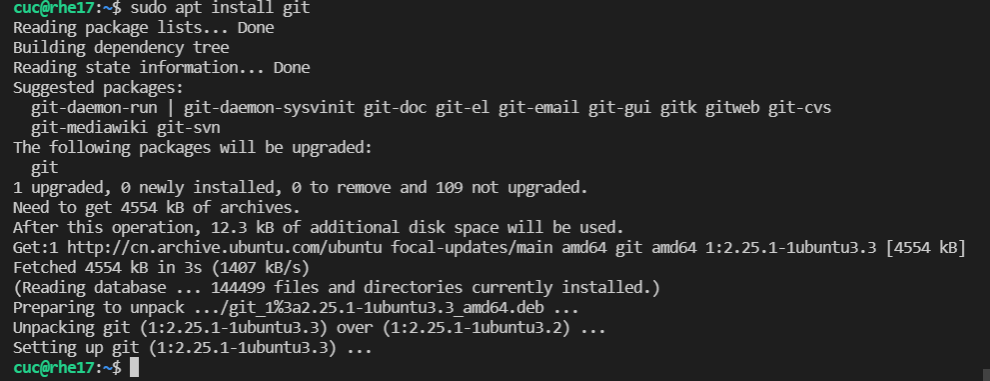
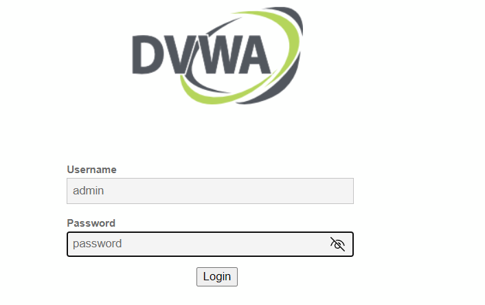
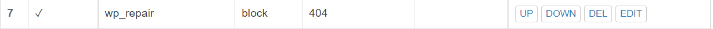
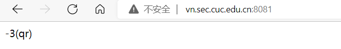

# 第五章：Web服务器（实验）

# 软件环境建议

- [Nginx](http://nginx.org/)
- [VeryNginx](https://github.com/alexazhou/VeryNginx)
- Wordpress
  - [WordPress 4.7](https://wordpress.org/wordpress-4.7.zip) | [备用下载地址](https://github.com/WordPress/WordPress/archive/4.7.zip)
- [Damn Vulnerable Web Application (DVWA)](http://www.dvwa.co.uk/)

# 实验检查点

## 基本要求

- 在一台主机（虚拟机）上同时配置Nginx和VeryNginx
  - VeryNginx作为本次实验的Web App的反向代理服务器和WAF
  - PHP-FPM进程的反向代理配置在nginx服务器上，VeryNginx服务器不直接配置Web站点服务
- 使用[Wordpress](https://wordpress.org/)搭建的站点对外提供访问的地址为： http://wp.sec.cuc.edu.cn
- 使用[Damn Vulnerable Web Application (DVWA)](http://www.dvwa.co.uk/)搭建的站点对外提供访问的地址为： http://dvwa.sec.cuc.edu.cn

## 安全加固要求

- 使用IP地址方式均无法访问上述任意站点，并向访客展示自定义的**友好错误提示信息页面-1**
- [Damn Vulnerable Web Application (DVWA)](http://www.dvwa.co.uk/)只允许白名单上的访客来源IP，其他来源的IP访问均向访客展示自定义的**友好错误提示信息页面-2**
- 在不升级Wordpress版本的情况下，通过定制[VeryNginx](https://github.com/alexazhou/VeryNginx)的访问控制策略规则，**热**修复[WordPress < 4.7.1 - Username Enumeration](https://www.exploit-db.com/exploits/41497/)
- 通过配置[VeryNginx](https://github.com/alexazhou/VeryNginx)的Filter规则实现对[Damn Vulnerable Web Application (DVWA)](http://www.dvwa.co.uk/)的SQL注入实验在低安全等级条件下进行防护

## VeryNginx配置要求

- [VeryNginx](https://github.com/alexazhou/VeryNginx)的Web管理页面仅允许白名单上的访客来源IP，其他来源的IP访问均向访客展示自定义的**友好错误提示信息页面-3**

- 通过定制VeryNginx的访问控制策略规则实现：

  - 限制DVWA站点的单IP访问速率为每秒请求数 < 50

  - 限制Wordpress站点的单IP访问速率为每秒请求数 < 20

  - 超过访问频率限制的请求直接返回自定义**错误提示信息页面-4**

  - 禁止curl访问

    

# 实验环境

**系统环境**

- Windows 10
  - IP：192.168.2.12
- Ubuntu 20.04 Server
  - IP：192.168.56.103

**软件环境**

- Nginx 1.18.0
- VeryNginx
- WordCompress 4.7

- Damn Vulnerable Web Application (DVWA)

| 端口      |      |
| --------- | ---- |
| VeryNginx | 8081 |
| Nginx     | 80   |
| WordPress | 8082 |
| DVWA      | 8080 |


# 实验过程

- 更改主机在`C:\Windows\System32\drivers\etc`的hosts文件：

  ```bash
   192.168.56.102 vn.sec.cuc.edu.cn
   192.168.56.102 dvwa.sec.cuc.edu.cn
   192.168.56.102 wp.sec.cuc.edu.cn
  ```


- 安装php及相关组件和mysql:

  `sudo apt install php-fpm php-mysql php-curl php-gd php-intl php-mbstring php-soap php-xml php-xmlrpc php-zip`

  

  `sudo apt -y install mysql-server`

## 基本要求

#### Nginx VeryNginx

**在一台主机（虚拟机）上同时配置Nginx和VeryNginx**

- 在虚拟机上安装Nginx：

  - 查看版本：`apt policy nginx`

  - 安装Nginx：`sudo apt update && sudo apt install nginx`

  - nginx安装完成并查看版本`nginx -V`：

    

  - 验证是否安装成功`sudo nginx -t`：

    

  - 运行：`ufw`

  ```bash
  sudo ufw app list
  ```

  - 通过输入以下内容来启用此功能：

  ```bash
  sudo ufw allow 'Nginx HTTP'
  ```

  - 通过运行以下命令来验证更改：

    ```bash
    sudo ufw status
    ```

  - nginx显示网页：（是80端口的
  - 

- 在虚拟机上安装VeryNginx：

  - 安装git：`sudo apt install git`

    

  - 克隆VeryNginx仓库到Linux，下载verynginx安装包：

    `git clone https://github.com/alexazhou/VeryNginx.git`

    

    

  - 安装相关依赖包：

    ```
    sudo apt-get install libssl-dev
    sudo apt install libpcre3 libpcre3-dev
    sudo apt install build-essential
    sudo apt install zlib1g-dev
    sudo apt install gcc
    sudo apt install make
    ```

  - 进入仓库：

    `cd VeryNginx`

  - 先关闭nginx`sudo nginx -s stop`:

  - 安装veryNginx：
    `sudo python3 install.py install`

  

  

**修改配置文件**

```bash
#进入到文件中进行修改：
sudo vim /opt/verynginx/openresty/nginx/conf/nginx.conf
```

- 在`/opt/verynginx/openresty/nginx/conf/nginx.conf`中，将`user nginx`改成`user www-data`。

  ```
  user  www-data;
  ```

- 修改监听端口为`192.168.56.102:8081`（修改verynginx

```
server {
        listen 192.168.56.102:8081;
        
        #this line shoud be include in every server block
        include /opt/verynginx/verynginx/nginx_conf/in_server_block.conf;

        location = / {
            root   html;
            index  index.html index.htm;
        }
    }
```


- 添加进程权限：

  `sudo chmod -R 777 /opt/verynginx/verynginx/configs`

- 建立软连接，可以通过`sudo verynginx`直接启动：
  `sudo ln -s /opt/VeryNginx/openresty/nginx/sbin/nginx /usr/sbin/verynginx`

  
  
- 这个命令可以修改Nginx配置(这个是修改Nginx的端口)

```bash
sudo vim /etc/nginx/sites-available/default
```

- 启动nginx服务：

  `sudo nginx`

  - 已经开启了：

    

- 关闭nginx：

  

  - 查看nginx的进程号：
    `ps -ef | grep nginx`
  - 查询出的nginx第二列就是nginx的进程号
  - 关闭对应进程
    `kill signal 41434`  
  - 这里虽然会报错，但是，这时候nginx的确是已经被关闭了

- 可以通过以下命令来运行 VeryNginx

  ```bash
  #启动服务
  sudo /opt/verynginx/openresty/nginx/sbin/nginx
  
  #停止服务
  sudo /opt/verynginx/openresty/nginx/sbin/nginx -s stop
  
  #重启服务
  sudo /opt/verynginx/openresty/nginx/sbin/nginx -s reload
  ```

- 成功连接8081端口：

- 访问：`192.168.56.102:8081/verynginx/index.html`

  用户名：`verynginx`

  密码：`verynginx`

  


- **mysql用于数据管理**：（前面已安装好`sudo apt install mysql-server`)

- 检查是否正常运行，输入当前用户密码,exit退出

  ```
   sudo mysql -u root -p 
  ```

#### Wordpress

**使用[Wordpress](https://wordpress.org/)搭建的站点对外提供访问的地址为： http://wp.sec.cuc.edu.cn**

- **新建数据库**用于Wordpress数据管理

  ```bash
  #登录mysql
  $ sudo mysql
  ```

  ```bash
      #创建wordpress数据库
      CREATE DATABASE wordpress DEFAULT CHARACTER SET utf8 COLLATE utf8_unicode_ci;
  ```

- 

```
# 创建cuc用户
create user 'cuc'@'localhost' identified by 'cuc';

# 给用户授权
grant all on wordpress.* to 'cuc'@'localhost';

# 退出
exit
```


- **PHP-FPM进程的反向代理配置在nginx服务器上**

- 创建ngnix下的配置文件

- 复制文件

  ```bash
  sudo cp /etc/nginx/sites-available/default /etc/nginx/sites-available/wp.sec.cuc.edu.cn
  ```

- 语法检查：`sudo nginx -t`

  

  ```bash
  #修改nginx配置文件
  $ sudo vim /etc/nginx/sites-enabled/default
       #将下列内容取消注释
       location ~ \.php$ {
              include snippets/fastcgi-php.conf;
              fastcgi_pass unix:/var/run/php/php7.2-fpm.sock;
       }
  
  #重新启动nginx
  sudo systemctl restart nginx
  ```

  - 取消注释:
  - 


- **安装其他扩展：**

  - 安装一些PHP扩展以用于WordPress：

    ```bash
    sudo apt update
    sudo apt install php-curl php-gd php-intl php-mbstring php-soap php-xml php-xmlrpc php-zip
    ```

  - 安装完扩展后，重新启动 PHP-FPM 进程，以便正在运行的 PHP 处理器可以利用新安装的功能：

    ```bash
    sudo systemctl restart php7.4-fpm
    ```

- 通过输入以下内容来检查配置是否存在语法错误：

  ```bash
  sudo nginx -t
  ```

- 如果未报告任何错误，请通过键入以下内容重新加载 Nginx：

  ```bash
  sudo systemctl reload nginx
  ```

- **安装WordPress:**

  - 切换到可写目录，然后通过输入以下内容下载压缩版本：

    ```bash
    cd /tmp
    curl -LO https://wordpress.org/latest.tar.gz
    ```

  - 解压缩文件以创建WordPress目录结构：

    ```bash
    tar xzvf latest.tar.gz
    ```

  - 暂时将这些文件移动到我们的文档根目录中。在执行此操作之前，我们可以将示例配置文件复制到 WordPress 实际读取的文件名：

    ```bash
    cp /tmp/wordpress/wp-config-sample.php /tmp/wordpress/wp-config.php
    ```

  - 将目录的全部内容复制到文档根目录中，使用该标志来确保我们的权限得到维护，在源目录的末尾使用一个点来指示应该复制目录中的所有内容，包括任何隐藏文件：`-a`

    ```bash
  sudo cp -a /tmp/wordpress/. /var/www/html/wp.sec.cuc.edu.cn/wordpress
    ```

  - 把它们的所有权分配给用户和组。这是Nginx运行的用户和组，Nginx需要能够读取和写入WordPress文件，以便为网站提供服务并执行自动更新。`www-data`
    
    ```bash
    sudo chown -R www-data:www-data /var/www/html/wp.sec.cuc.edu.cn/wordpress
    ```
    
    文件现在位于服务器的文档根目录中，并且具有正确的所有权
    
    

- **设置WordPress配置文件**

  - 要从WordPress密钥生成器中获取安全值：

    ```bash
    curl -s https://api.wordpress.org/secret-key/1.1/salt/
    ```

  - 直接粘贴到配置文件中以设置安全密钥。复制现在的输出。

  - 打开WordPress配置文件：

    ```bash
    sudo vim /var/www/html/wp.sec.cuc.edu.cn/wordpress/wp-config.php
    ```

- ```bash
  // ** MySQL settings - You can get this info from your web host ** //
  /** The name of the database for WordPress */
  define('DB_NAME', 'wordpress');
  
  /** MySQL database username */
  define('DB_USER', 'cuc');
  
  /** MySQL database password */
  define('DB_PASSWORD', 'cuc');
  
  /** MySQL hostname */
  define('DB_HOST', 'localhost');
  
  /** Database Charset to use in creating database tables. */
  define('DB_CHARSET', 'utf8');
  
  /** The Database Collate type. Don't change this if in doubt. */
  define('DB_COLLATE', '');
  
  define('FS_METHOD', 'direct');
  ```


- 做了修改后，重启mysql：

  ```bash
  sudo systemctl restart mysql.service 
  ```
  
- 建立连接

  ```bash
  # 建立软链接
  sudo ln -s /etc/nginx/sites-available/wp.sec.cuc.edu.cn /etc/nginx/sites-enabled/
  
  # 启动nginx
  sudo systemctl restart nginx
  ```

- 访问成功：

  - 安装wordpress:

  - wordpress界面:

#### DVWA

- 安装：

  - ```bash
    # 下载
    git clone https://github.com/digininja/DVWA.git
    # 建立目录
    sudo mkdir /var/www/html/dvwa.sec.cuc.edu.cn
    # 把下载好的DVWA移到刚刚创建的目录下
    sudo mv DVWA/* /var/www/html/dvwa.sec.cuc.edu.cn
    
    # 修改文件夹属主为 www-data
    sudo chown -R www-data:www-data /var/www/html/dvwa.sec.cuc.edu.cn
    ```

- 配置MySQL：

  - ```bash
    # 启动MySQL
    sudo mysql
    # 建立dvwa的数据库
    CREATE DATABASE dvwa DEFAULT CHARACTER SET utf8 COLLATE utf8_unicode_ci;
    # 创建用户
    CREATE USER 'dvwa'@'localhost' IDENTIFIED BY 'cuc';
    # 授权
    GRANT ALL ON dvwa.* TO 'dvwa'@'localhost';
    # 退出
    exit
    # 重启mysql使配置文件生效
    sudo systemctl restart mysql
    ```

- 配置PHP：

  - ```bash
    # 将/var/www/html/dvwa.sec.cuc.edu.cn/config/目录下的config.inc.php.dist文件改名为config.inc.php
    cd /var/www/html/dvwa.sec.cuc.edu.cn/config/
    sudo mv config.inc.php.dist config.inc.php
    
    # 默认配置：
    $_DVWA[ 'db_database' ] = 'dvwa';
    $_DVWA[ 'db_user' ] = 'dvwa';
    $_DVWA[ 'db_password' ] = 'cuc';
    
    # 修改php-fpm文件
    sudo vim /etc/php/7.4/fpm/php.ini 
    
    allow_url_include: On
    
    #重启php
    systemctl restart php7.4-fpm.service
    
    #授权给www-data用户和组
    sudo chown -R www-data.www-data /var/www/html/dvwa.sec.cuc.edu.cn
    ```

  - 修改dvwa默认配置:

    

  - 修改php-fpm文件:

- 配置服务器块文件:

  ```bash
  sudo vim /etc/nginx/sites-available/dvwa.sec.cuc.edu.cn
  
  # 写入配置文件
  server {
      listen 8080 default_server;
      listen [::]:8080 default_server;
  
      root /var/www/html/dvwa.sec.cuc.edu.cn;
      index index.php index.html index.htm index.nginx-debian.html;
      server_name dvwa.sec.cuc.edu.cn;
  
      location / {
          #try_files $uri $uri/ =404;
          try_files $uri $uri/ /index.php$is_args$args;  
      }
  
      location ~ \.php$ {
          include snippets/fastcgi-php.conf;
          fastcgi_pass unix:/var/run/php/php7.4-fpm.sock;
      }
  
      location ~ /\.ht {
          deny all;
      }
  }
  
  # 创建软链接
  sudo ln -s /etc/nginx/sites-available/dvwa.sec.cuc.edu.cn /etc/nginx/sites-enabled/
  
  # 检查并重启服务
  sudo nginx -t
  systemctl restart nginx.service
  ```

  - 写入DVWA:

  - 

  - 用户名：`dvwa` 密码：`cuc`

  - 创建数据库 点击`login.php`页面下方的`Create/Reset Database`生成需要使用的数据库。
  - 

  - 数据库连接成功，页面直接跳转到登录页面，此时使用`admin/password`登录：

    

  - 登陆成功：

- 但是不能通过 http://dvwa.sec.cuc.edu.cn访问，只能通过192.168.56.102：8080：

  
  
  - 终于知道是什么问题了、、是因为我hosts文件没有加上我的这台虚拟机的IP呜呜
  - 终于dvwa：
  - 

## 安全加固要求

- **1.使用VeryNginx反向代理WordPress，DVWA 添加Match，Proxy Pass，UpStream**

  - 添加match:

  - 添加stream：

  - 添加Proxy:

  - 成功登录wordpress:

    

- **2.使用IP地址方式均无法访问上述任意站点，并向访客展示自定义的友好错误提示信息页面-1**

  - 配置match:

  - 设置相应response:

  - 设置filter阻止ip地址访问:

  - 显示负一:

  - 但是很奇怪，我一直没有解决这个问题，就是它只会阻止192.168.56.102:8081/verynginx并显示负一，其他的192.168.56.102:8080等还是正常访问。然后我试了一下把HOST改为IP还是一样的结果。只能**手动删除 config.json 来清空配置**。

  - 删除用rm命令：

    ```
    sudo rm /opt/verynginx/verynginx/configs/config.json
    ```

- **3.DVWA只允许白名单上的访客来源IP，其他来源的IP访问均向访客展示自定义的友好错误提示页面-2**

  - 添加matcher,ban掉自己的ip 

  - Response:

  - Filter:

  - 出现负二:
  - ip192.168.56.102的正常访问：

- **4.在不升级Wordpress版本的情况下，通过定制[VeryNginx](https://github.com/alexazhou/VeryNginx)的访问控制策略规则，热修复[WordPress < 4.7.1 - Username Enumeration](https://www.exploit-db.com/exploits/41497/)**

  - 添加matcher:
  - 添加filter:
  - 添加后访问失败，返回404:

- 5.通过配置VeryNginx的Filter规则实现对Damn Vulnerable Web Application (DVWA)的SQL注入实验在低安全等级条件下进行防护

  - 将security level修改为low

  - Match:
  - Filter:

  - 结果：

## VeryNginx配置要求

- **1.[VeryNginx](https://github.com/alexazhou/VeryNginx)的Web管理页面仅允许白名单上的访客来源IP，其他来源的IP访问均向访客展示自定义的友好错误提示信息页面-3**

  - matcher:
  - response:
  - filter:
  - 结果：

- **2.通过定制VeryNginx的访问控制策略规则实现：**

  - 限制DVWA站点的单IP访问速率为每秒请求数 < 50

  - 限制Wordpress站点的单IP访问速率为每秒请求数 < 20

  - 超过访问频率限制的请求直接返回自定义**错误提示信息页面-4**

  - 禁止curl访问

    - response设置：
    
    - Frequency Limit设置：
    
    - 编辑虚拟机的hosts文件
    
      `sudo vim /etc/hosts`
      
      ```bash
      # 加上以下内容
      192.168.56.102 vn.sec.cuc.edu.cn
      192.168.56.102 dvwa.sec.cuc.edu.cn
      192.168.56.102 wp.sec.cuc.edu.cn
      ```
      
      - 
      
    - 使用ab压力测试工具

      - ```bash
        # 下载包以使用ab进行测试
        sudo apt update
        sudo apt install apache2-utils 
        ```
    
      - 测试wp.sec.cuc.edu.cn和dvwa.sec.cuc.edu.cn
    
        ```bash
        ab -c 10 -n 100 http://wp.sec.cuc.edu.cn/
        ab -c 10 -n 100 http://dvwa.sec.cuc.edu.cn/
        
        ```
    
      - 结果：
    
    - 超过访问频率限制的请求直接返回自定义**错误提示信息页面-4**
    
      - matcher：
        - 
      - response：
        - 
      - filter：
        - 
      - 结果：
        - 


# 实验遇到的问题

- 如果不能重启或者关闭nginx，可以先`ps -ef|grep nginx`查看有什么进程，再`sudo kill +进程号`。(如下图)

  

- 访问不了192.168.56.103:80：

  觉得可能是端口被占用了，我就把端口改成了8081(后来发现端口被apache2占用了，只要kill就行了，但是还是觉得改端口号比较方便)：

  

  就可以成功访问到了：

  

- 访问不了192.168.56.103:8080：

  我telnet 192.168.56.103:8081是可以连接的浏览器也是正常显示的，

  但是192.168.56.103:8080可以连接但是浏览器不能访问

  

  8080端口打开的页面:

- 访问web服务器为apache：

  - 
  - 
  - **停止** Apache 服务： `sudo systemctl stop apache2`
  
- 访问不了[192.168.56.103/verynginx/index.html](http://192.168.56.103/verynginx/index.html)

  - 如果19.168.56.103：8081可以成功访问后，亦可以成功访问http://192.168.56.103:8081/verynginx/index.html
  - 

- 访问8081端口显示403:

  - 
  - 如果您发现某个文件或文件夹存在一定程度的问题，请检查权限并更改权限。 如果您不知道，**建议将文件应用于“644”或“640”，将目录（文件夹）应用于“755”或“750”。 将“440”或“400”应用于“wp-config.php”文件**。权限我设置了wordpress目录是sudo chmod 755；文件里的内容是sudo chmod 644 *

- 可以通过 `sudo ss -lnpt | grep 8081` 查看 `8081` 端口当前有没有进程在监听。通过 `ps aux | grep nginx` 检查目前系统中是否启动了 `verynginx` 自带的 `nginx`

- 遇到`nginx: configuration file /home/xx.local/etc/nginx/nginx.conf test failed`w问题：

  - 解决办法： `sudo /etc/init.d/nginx start`

- [emerg] a duplicate default server for 0.0.0.0:8080 in /etc/nginx/sites-enabled/wp:22

  删除rm 文件，重新启动服务即可

- 遇到这个问题：

```bash
qr@qrubuntu:/etc/nginx/sites-enabled$ sudo nginx -t
nginx: [emerg] a duplicate default server for 0.0.0.0:8080 in /etc/nginx/sites-enabled/wp:22
nginx: configuration file /etc/nginx/nginx.conf test failed
```


根据图片我删掉了同内容的文件，再检查一次就成功了。

- 原因是因为之前卸载nginx时没卸载干净，导致此错误，执行以下指令清除干净后安装即可

  ```bash
  sudo apt-get remove nginx nginx-common
  sudo apt-get purge nginx nginx-common
  sudo apt-get autoremove
  sudo apt-get remove nginx-full nginx-common
  sudo apt-get install nginx
  ```

  ps：这次错误真的很多、、但是只是冰山一角罢了ww鬼知道我经历了什么
  

# 参考链接

- [如何修改Hosts文件-百度经验 (baidu.com)](https://jingyan.baidu.com/article/335530dafcb63719cb41c3ad.html)

- https://blog.csdn.net/qq_41800366/article/details/107093037

- [报Apache/2.4.29 (Ubuntu) Server at admin.milebb.cn Port 80 的解决方法 - Mr、桔子 - 博客园 (cnblogs.com)](https://www.cnblogs.com/yuuje/p/12395339.html)

- https://blog.csdn.net/weixin_42896137/article/details/88797094?spm=1001.2101.3001.6661.1&utm_medium=distribute.pc_relevant_t0.none-task-blog-2%7Edefault%7ECTRLIST%7Edefault-1.pc_relevant_default&depth_1-utm_source=distribute.pc_relevant_t0.none-task-blog-2%7Edefault%7ECTRLIST%7Edefault-1.pc_relevant_default&utm_relevant_index=1

- https://blog.csdn.net/qq_22638399/article/details/81060535?spm=1001.2101.3001.6661.1&utm_medium=distribute.pc_relevant_t0.none-task-blog-2%7Edefault%7ECTRLIST%7ERate-1.pc_relevant_paycolumn_v3&depth_1-utm_source=distribute.pc_relevant_t0.none-task-blog-2%7Edefault%7ECTRLIST%7ERate-1.pc_relevant_paycolumn_v3&utm_relevant_index=1

- [如何在Ubuntu 18.04上安装Linux，Nginx，MySQL，PHP（LEMP堆栈）|数字海洋 (digitalocean.com)](https://www.digitalocean.com/community/tutorials/how-to-install-linux-nginx-mysql-php-lemp-stack-ubuntu-18-04)

- [(46条消息) Linux 下安装 Wordpress教程_leon_zeng0的博客-CSDN博客_linux wordpress](https://blog.csdn.net/leon_zeng0/article/details/107837049)

- [如何在Ubuntu 18.04上安装带有LEMP的WordPress|数字海洋 (digitalocean.com)](https://www.digitalocean.com/community/tutorials/how-to-install-wordpress-with-lemp-on-ubuntu-18-04)

- [如何在Ubuntu 18.04上安装带有LEMP的WordPress|数字海洋 (digitalocean.com)](https://www.digitalocean.com/community/tutorials/how-to-install-wordpress-with-lemp-on-ubuntu-18-04)

- [如何启动，停止和重启Apache - 云+社区 - 腾讯云 (tencent.com)](https://cloud.tencent.com/developer/article/1626890#:~:text=运行下面的命令，停止 Apache 服务：,sudo systemctl stop apache2)

- [nginx启动命令是什么-Nginx-PHP中文网](https://www.php.cn/nginx/478232.html)

- [如何在Ubuntu 18.04上安装带有LEMP的WordPress|数字海洋 (digitalocean.com)](https://www.digitalocean.com/community/tutorials/how-to-install-wordpress-with-lemp-on-ubuntu-18-04)

- [(46条消息) nginx: configuration file /home/xx.local/etc/nginx/nginx.conf test failed_流浪德意志的博客-CSDN博客](https://blog.csdn.net/li4692625/article/details/113830996)

- [(46条消息) nginx配置说明以及VeryNginx使用_每天进步一点点...._____的博客-CSDN博客_verynginx](https://blog.csdn.net/weixin_40803329/article/details/101446194#:~:text=service nginx start 到安装nginx 目录如%2Fusr%2Flocal%2Fnginx%2Fsbin 启动nginx.%2Fnginx 如果要关闭或者重启nginx,则ps -ef | grep nginx 然后杀掉master%2Cworker 进程 重新启动)c'd

- [在 /etc/nginx/sites-enabled/default 错误中重复 0.0.0.0：80 的默认服务器，重复在哪里？- 堆栈溢出 (stackoverflow.com)](https://stackoverflow.com/questions/60149785/duplicate-default-server-for-0-0-0-080-in-etc-nginx-sites-enabled-default-erro)

- [如何处理 WordPress 网站上的“403 转发”错误 (kinsta.com)](https://kinsta.com/jp/blog/403-forbidden-error/)

  ps：这次参考链接真的很多、、但是只是冰山一角罢了


# 总结

​	真的会谢这次作业，我5.14从十二点做到凌晨两点，然后还是没解决wordpress页面渲染问题（就是第一部分基本要求 都没有完成好，感觉就是五六个小时都在解决，但是只能说时间久我也对wordpress和dvwa这些安装顺序、步骤和文件的联系有了更进一步的了解，也对端口的处理和查看等操作更熟练了。还是不得不感谢揭青莹师姐，差点就要去搭环境了（bushi，然后就是有点遗憾但是大致完美的完成了此次H5作业！wow！撒花*★,°*:.☆(￣▽￣)/$:*.°★* 。