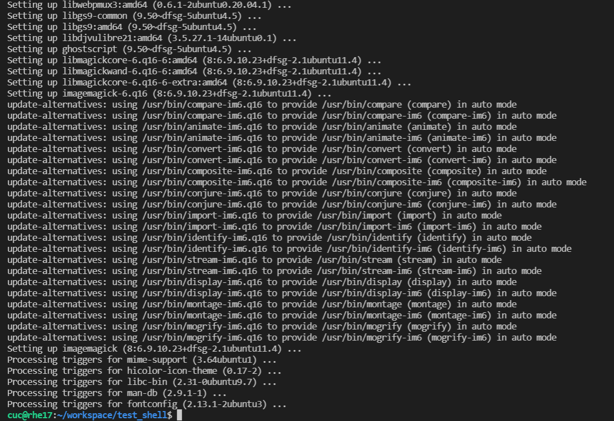
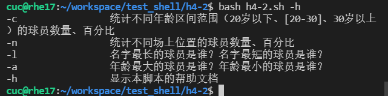
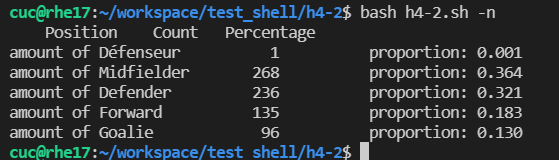
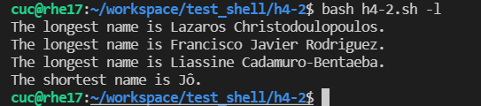

# 实验四

## 实验任务

#### 任务一

用bash编写一个图片批处理脚本，实现以下功能：

- 支持命令行参数方式使用不同功能
- 支持对指定目录下所有支持格式的图片文件进行批处理
- 支持以下常见图片批处理功能的单独使用或组合使用
  - 支持对jpeg格式图片进行图片质量压缩
  - 支持对jpeg/png/svg格式图片在保持原始宽高比的前提下压缩分辨率
  - 支持对图片批量添加自定义文本水印
  - 支持批量重命名（统一添加文件名前缀或后缀，不影响原始文件扩展名）
  - 支持将png/svg图片统一转换为jpg格式图片


#### 任务二

用bash编写一个文本批处理脚本，对以下附件分别进行批量处理完成相应的数据统计任务：

- 2014世界杯运动员数据
  - 统计不同年龄区间范围（20岁以下、[20-30]、30岁以上）的球员**数量**、**百分比**
  - 统计不同场上位置的球员**数量**、**百分比**
  - 名字最长的球员是谁？名字最短的球员是谁？
  - 年龄最大的球员是谁？年龄最小的球员是谁？

- Web服务器访问日志

  - 统计访问来源主机TOP 100和分别对应出现的总次数

  - 统计访问来源主机TOP 100 IP和分别对应出现的总次数

  - 统计最频繁被访问的URL TOP 100

  - 统计不同响应状态码的出现次数和对应百分比

  - 分别统计不同4XX状态码对应的TOP 10 URL和对应出现的总次数

  - 给定URL输出TOP 100访问来源主机


### 实验报告要求

- 继承[第一章：Linux基础（实验）](https://c4pr1c3.github.io/LinuxSysAdmin/chap0x01.exp.md.html)的所有实验报告要求
- 上述任务的所有源代码文件必须单独提交并提供详细的**–help**脚本内置帮助信息
- 任务二的所有统计数据结果要求写入独立实验报告

### 实验步骤

#### 任务一

- 安装shellcheck

  `sudo apt-get update && sudo apt-get install -y shellcheck`

  发现是已经安装好了的

  

- 安装imagemagick

  `sudo apt-get install -y imagemagick`

  安装成功：

  

- 将测试图片导入到虚拟机的test_shell文件夹里面

  

- 根据任务一的内容编写脚本并进行shellcheck：

- 

  ```bash
  #!/usr/bin/env bash
  
  function help {
      echo "========图片处理脚本的帮助文档========"
      echo "
      脚本支持：
      1.命令行参数方式使用不同功能
      2.对指定目录下所有支持格式的图片文件进行批处理指定目录进行批处理
      3.以下常见图片批处理功能的单独使用或组合使用
          ①对jpeg格式图片进行图片质量压缩
          ②对jpeg/png/svg格式图片在保持原始宽高比的前提下压缩分辨率
          ③对图片批量添加自定义文本水印
          ④批量重命名（统一添加文件名前缀或后缀，不影响原始文件扩展名）
          ⑥将png/svg图片统一转换为jpg格式；
      -q Q               对jpeg格式图片进行图片质量因子为Q的压缩
      -d D               对jpeg/png/svg格式图片在保持原始宽高比的前提下压缩成D分辨率
      -w fontsize watermark_text  对图片批量添加自定义文本水印
      -p text            批量重命名，统一添加文件名前缀，不影响原始文件扩展名
      -s text            批量重命名，统一添加文件名后缀，不影响原始文件扩展名
      -t                 将png/svg图片统一转换为jpg格式图片
      -h                 显示本脚本的帮助文档"
  }
  
  
  #①支持对jpeg格式图片进行图片质量压缩
  #convert filename1 -quality 50 filename2
  function Picture_quality_compression(){
      Q=$1 # 质量因子
      for i in *;do
          type=${i##*.} # 获取文件类型 （删除最后一个.及左边的全部字符）
          if [[  ${type} != "jpeg" ]]; then continue; fi;
          convert "${i}" -quality "${Q}" "${i}"
          echo "Compressing ${i} -- down."
      done
      echo "========图片质量压缩完成========"
  }
  
  #②支持对jpeg/png/svg格式图片在保持原始宽高比的前提下压缩分辨率
  #convert filename1 -resize 50% filename2
  function Compression_resolution(){
      D=$1
      for i in *;do
          type=${i##*.}
          if [[ ${type} != "jpg" && ${type} != "jpeg" && ${type} != "png" && ${type} != "svg" ]]; then continue; fi;
          convert "${i}" -resize "${D}" "${i}"
          echo "Proportional compressing ${i} is complete."
      done
      echo "=========分辨率压缩完成========="
  }
  
  #③支持对图片批量添加自定义文本水印
  # convert filename1 -pointsize 50 -fill black -gravity center -draw "text 10,10 'Works like magick' " filename2
  function add_watermarking(){
      for i in *;do
          type=${i##*.}
          if [[ ${type} != "jpg" && ${type} != "jpeg" && ${type} != "png" && ${type} != "svg" ]]; then continue; fi;
          convert "${i}" -pointsize "$1"  -draw "text 0,20 '$2'" "${i}"
          echo "Watermarking ${i} with $2 is complete."
      done
      echo "==========添加水印完成=========="
      return
  }
  
  #④支持批量重命名（统一添加文件名前缀或后缀，不影响原始文件扩展名）
  #1.批量重命名，统一添加文件名前缀，不影响原始文件扩展名
  # mv filename1 filename2
  function add_prefix(){
      for i in *;do
          type=${i##*.}
          if [[ ${type} != "jpg" && ${type} != "jpeg" && ${type} != "png" && ${type} != "svg" ]]; then continue; fi;
          mv "${i}" "$1""${i}"
          echo "${i} is prefixed as $1${i} "
      done
      echo "=========批量重命名加前缀完成=========="
  }
  
  #2.批量重命名，统一添加文件名后缀，不影响原始文件扩展名
  # mv filename1 filename2
  function add_suffix(){
      for i in *;do
          type=${i##*.}
          if [[ ${type} != "jpg" && ${type} != "jpeg" && ${type} != "png" && ${type} != "svg" ]]; then continue; fi;
          newname=${i%.*}$1"."${type}
          mv "${i}" "${newname}"
          echo "${i} is suffixed as ${newname} "
      done
      echo "=========批量重命名加后缀完成=========="
  
  }
  
  #支持将png/svg图片统一转换为jpg格式图片
  # convert xxx.png xxx.jpg
  function trans_jpg(){
      for i in *;do
          type=${i##*.}
          if [[ ${type} != "png" && ${type} != "svg" ]]; then continue; fi;
          newfile=${i%.*}".jpg"
          convert "${i}" "${newfile}"
     	echo "Transform ${i} to ${newfile}is complete."
      done
      echo "==========转换格式完成=========="
  }
  
  # 以下实现命令行参数方式使用不同功能
  while true;do
  case "$1" in
      "-q")
          Picture_quality_compression "$2"
          exit 0
          ;;
      "-d")
          Compression_resolution "$2"
          exit 0
          ;;
      "-w")
          add_watermarking "$2" "$3"
          exit 0
          ;;
      "-p")
          add_prefix "$2"
          exit 0
          ;;
      "-s")
          add_suffix "$2"
          exit 0
          ;;
      "-t")
          trans_jpg
          exit 0
          ;;
      "-h")
          help
          exit 0
          ;;
  esac
  help
  exit 0
  done
  
  
  ```

- 测试执行：

  - 1.

  - 直接执行脚本文件不带参数

    `bash h4-1.sh` 了解到该脚本文件的一些内容和帮助。

  

  - 2.显示本脚本的帮助文档

  - 执行`bash h4-1.sh -h`

    为 帮助文档

    

    

  - 3.对jpeg格式图片进行图片质量因子为Q的压缩

  - 先执行`identify test5.jpeg`查看图片信息

  - 再执行`bash h4-1.sh -q 50`

  - 最后执行`identify test5.jpeg`查看图片压缩后的信息

    

  

  - 4.对jpeg/png/svg格式图片在保持原始宽高比的前提下压缩成D分辨率

  - 查看压缩前图片详细信息：

    `identify test1.jpg test2.png test3.JPG test4.svg test5.jpeg `

    

  (为什么是70*70：因为我之前压缩过一次了所以就不是原始图像的大小)

  - 执行`bash h4-1.sh -d 90`

    

  - 再查看图片的详细信息：

    

  - 有一个问题：为什么会出现上图的报错，即

    `identify-im6.q16: Unescaped '<' not allowed in attributes values
     `No such file or directory` @ error/svg.c/SVGError/2998.
    identify-im6.q16: attributes construct error
     `No such file or directory` @ error/svg.c/SVGError/2998.
    identify-im6.q16: error parsing attribute name
     `No such file or directory` @ error/svg.c/SVGError/2998.
    identify-im6.q16: attributes construct error
     `No such file or directory` @ error/svg.c/SVGError/2998.
    identify-im6.q16: xmlParseStartTag: problem parsing attributes
     `No such file or directory` @ error/svg.c/SVGError/2998.
    identify-im6.q16: Couldn't find end of Start Tag g
     `No such file or directory` @ error/svg.c/SVGError/2998.`

  - 发现应该是.svg文件报的错，svg图片进行压缩之后变成

    

  - 原始svg图像为：

    

  - 但是不太清楚为什么会报错，svg图像不可压缩吗？

    

  - 5.对图片批量添加自定义文本水印

  - 执行`bash h4-1.sh -w 5 qr` 对文件加字体大小为5的qr数字水印

    

  

  - 6.批量重命名，统一添加文件名前缀，不影响原始文件扩展名
  - 在文件名前面加QR：`bash h4-1.sh -p QR`
  - 

  

  - 7.批量重命名，统一添加文件名后缀，不影响原始文件扩展名

  - 在文件名后面加CUC：`bash h4-1.sh -s CUC`

  - 

    

  - 8.将png/svg图片统一转换为jpg格式图片
  - 执行：`bash h4-1.sh -t`
  - 

#### 任务二-1

- 将worldcupplayerinfo.tsv文件导入到虚拟机中（我是直接拖拽的）

- 根据任务二编写脚本文件h4-2.sh并进行shellcheck:

- 

  ```bash
  #!/usr/bin/env bash
  
  #用bash编写一个文本批处理脚本，对以下附件分别进行批量处理完成相应的数据统计任务：
  #- 2014世界杯运动员数据
    #- 统计不同年龄区间范围（20岁以下、[20-30]、30岁以上）的球员**数量**、**百分比**
    #- 统计不同场上位置的球员数量、百分比
    #- 名字最长的球员是谁？名字最短的球员是谁？
    #- 年龄最大的球员是谁？年龄最小的球员是谁？
  
  file="worldcupplayerinfo.tsv"
  
  function help {
      echo "-c                 统计不同年龄区间范围（20岁以下、[20-30]、30岁以上）的球员数量、百分比"
      echo "-n                 统计不同场上位置的球员数量、百分比"
      echo "-l                 名字最长的球员是谁？名字最短的球员是谁？"
      echo "-a                 年龄最大的球员是谁？年龄最小的球员是谁？"
      echo "-h                 显示本脚本的帮助文档"
  }
  
  # 1.统计不同年龄区间范围（20岁以下、[20-30]、30岁以上）的球员数量、百分比
  function count_age() {
      awk -F "\t" 'BEGIN {a=0; b=0; c=0;}
          $6!="Age" {
              if($6>=0&&$6<20) {a++;}
              else if($6>=20&&$6<=30) {b++;}
              else {c++;}
          }
          END {
              sum=a+b+c;
              printf("Age\tCount\tPercentage\n");
              printf("<20\t%d\t%f%%\n",a,a*100.0/sum);
              printf("[20,30]\t%d\t%f%%\n",b,b*100.0/sum);
              printf(">30\t%d\t%f%%\n",c,c*100.0/sum);
          }'  "$file"
  }
  
  # 2.统计不同场上位置的球员数量、百分比
  function count_num() {
      awk -F "\t" '
          BEGIN {sum=0}
          $5!="Position" {
              pos[$5]++;
              sum++;
          }
          END {
              printf("    Position\tCount\tPercentage\n");
              for(i in pos) {
                  printf("amount of %-15s%5d\t\tproportion: %.3f\n",i,pos[i],pos[i]/sum);
              }
          }'  "$file"
  }
  
  # 3.名字最长的球员是谁？名字最短的球员是谁？
  function  name_length(){
      awk -F "\t" '
          BEGIN {max=-1; min=999;}
          $9!="Player" {
              len=length($9);
              names[$9]=len;
              max=len>max?len:max;
              min=len<min?len:min;
          }
          END {
              for(i in names) {
                  if(names[i]==max) {
                      printf("The longest name is %s.\n", i);
                  } else  if(names[i]==min) {
                      printf("The shortest name is %s.\n", i);
                  }
              }
          }'  "$file"
  }
  
  # 4.年龄最大的球员是谁？年龄最小的球员是谁？(考虑并列)
  function age_extrem() {
      awk -F "\t" '
          BEGIN {max=-1; min=999;}
          $6!="Age"  {
              age=$6;
              names[$9]=age;
              max=age>max?age:max;
              min=age<min?age:min;
          }
          END {
              printf("The oldest age is %d, his name is\t.", max);
              for(i in names) {
                  if(names[i]==max) { printf("%s\n", i); }
              }
              printf("The youngest age is %d, his name is\t.", min);
              for(i in names) {
                  if(names[i]==min) { printf("%s\n", i); }
              }
          }'  "$file"
  }
  
  while true;do
      case "$1" in
          "-c")
              count_age
              exit 0
              ;;
          "-n")
              count_num
              exit 0
              ;;
          "-l")
              name_length
              exit 0
              ;;
          "-a")
              age_extrem
              exit 0
              ;;
          "-h")
              help
              exit 0
              ;;
      esac
      help
      exit 0
  done
  ```

  

- 测试过程及结果：

  - 1.直接执行：`bash h4-2.sh`

    

  - 2.查看帮助文档：`bash h4-2.sh -h`

    

  - 3.统计不同年龄区间范围（20岁以下、[20-30]、30岁以上）的球员数量、百分比：`bash h4-2.sh -c`

    

  - 4.统计不同场上位置的球员数量、百分比:`bash h4-2.sh -n`

    

  - 5.名字最长的球员是谁？名字最短的球员是谁？

    `bash h4-2.sh -l`

    

  - 6.年龄最大的球员是谁？年龄最小的球员是谁？

    `bash h4-2.sh -a`

    


#### 任务二-2

- 根据任务二编写h4-3.sh脚本文件并进行shellcheck：
- 

```bash
```


- 1.统计访问来源主机TOP 100和分别对应出现的总次数

  `bash h4-3.sh -c`

  

  输出结果：			

  ​						hostname       		 count
  ​                      edams.ksc.nasa.gov        6530
  ​                    piweba4y.prodigy.com        4846
  ​                            163.206.89.4        4791
  ​                    piweba5y.prodigy.com        4607
  ​                    piweba3y.prodigy.com        4416
  ​                    www-d1.proxy.aol.com        3889
  ​                    www-b2.proxy.aol.com        3534
  ​                    www-b3.proxy.aol.com        3463
  ​                    www-c5.proxy.aol.com        3423
  ​                    www-b5.proxy.aol.com        3411
  ​                    www-c2.proxy.aol.com        3407
  ​                    www-d2.proxy.aol.com        3404
  ​                    www-a2.proxy.aol.com        3337
  ​                             news.ti.com        3298
  ​                    www-d3.proxy.aol.com        3296
  ​                    www-b4.proxy.aol.com        3293
  ​                    www-c3.proxy.aol.com        3272
  ​                    www-d4.proxy.aol.com        3234
  ​                    www-c1.proxy.aol.com        3177
  ​                    www-c4.proxy.aol.com        3134
  ​                 intgate.raleigh.ibm.com        3123
  ​                    www-c6.proxy.aol.com        3088
  ​                    www-a1.proxy.aol.com        3041
  ​                  mpngate1.ny.us.ibm.net        3011
  ​                      e659229.boeing.com        2983
  ​                    piweba1y.prodigy.com        2957
  ​                        webgate1.mot.com        2906
  ​                  www-relay.pa-x.dec.com        2761
  ​                          beta.xerox.com        2318
  ​                       poppy.hensa.ac.uk        2311
  ​                      vagrant.vf.mmc.com        2237
  ​                      palona1.cns.hp.com        1910
  ​      www-proxy.crl.research.digital.com        1793
  ​                          koriel.sun.com        1762
  ​                                   derec        1681
  ​                trusty.lmsc.lockheed.com        1637
  ​                             gw2.att.com        1623
  ​                cliffy.lfwc.lockheed.com        1563
  ​                           inet2.tek.com        1503
  ​                    disarray.demon.co.uk        1485
  ​                             gw1.att.com        1467
  ​                            128.217.62.1        1435
  ​                    interlock.turner.com        1395
  ​                            163.205.1.19        1360
  ​                         sgigate.sgi.com        1354
  ​              bocagate.bocaraton.ibm.com        1336
  ​                    piweba2y.prodigy.com        1324
  ​                             gw3.att.com        1311
  ​                   keyhole.es.dupont.com        1310
  ​                   n1144637.ksc.nasa.gov        1297
  ​                           163.205.3.104        1292
  ​                          163.205.156.16        1256
  ​                           163.205.19.20        1252
  ​                     erigate.ericsson.se        1216
  ​                          gn2.getnet.com        1211
  ​                        gwa.ericsson.com        1089
  ​                     tiber.gsfc.nasa.gov        1079
  ​                            128.217.62.2        1054
  ​                 bstfirewall.bst.bls.com        1017
  ​                          163.206.137.21        1015
  ​                          spider.tbe.com        1013
  ​                gatekeeper.us.oracle.com        1010
  ​                    www-c8.proxy.aol.com        995
  ​           whopkins.sso.az.honeywell.com        984
  ​                      news.dfrc.nasa.gov        966
  ​                         128.159.122.110        949
  ​                 proxy0.research.att.com        940
  ​                    proxy.austin.ibm.com        925
  ​                    www-c9.proxy.aol.com        902
  ​                     bbuig150.unisys.com        901
  ​                         corpgate.nt.com        899
  ​                      sahp315.sandia.gov        890
  ​                          amdext.amd.com        869
  ​                          128.159.132.56        848
  ​                   n1121796.ksc.nasa.gov        830
  ​                        igate.uswest.com        825
  ​             gatekeeper.cca.rockwell.com        819
  ​                    wwwproxy.sanders.com        815
  ​                             gw4.att.com        814
  ​                            goose.sms.fi        812
  ​                          128.159.144.83        808
  ​                  jericho3.microsoft.com        805
  ​                         128.159.111.141        798
  ​                  jericho2.microsoft.com        786
  ​          sdn_b6_f02_ip.dny.rockwell.com        782
  ​                     lamar.d48.lilly.com        778
  ​                           163.205.11.31        776
  ​                   heimdallp2.compaq.com        772
  ​                    stortek1.stortek.com        771
  ​                           163.205.16.75        762
  ​                    mac998.kip.apple.com        759
  ​                         tia1.eskimo.com        742
  ​                         www-e1f.gnn.com        733
  ​                    www-b1.proxy.aol.com        718
  ​                  reddragon.ksc.nasa.gov        715
  ​                         128.159.122.137        711
  ​                       bambi.te.rl.ac.uk        701
  ​                            rmcg.cts.com        701
  ​                        electron.mcc.com        697
  ​                           163.205.23.76        691

- 2.统计访问来源主机TOP 100 IP和分别对应出现的总次数

  执行：`bash h4-3.sh -i`

  

  输出结果：

           IP    count
          163.206.89.4    4791
          128.217.62.1    1435
          163.205.1.19    1360
         163.205.3.104    1292
        163.205.156.16    1256
         163.205.19.20    1252
          128.217.62.2    1054
        163.206.137.21    1015
       128.159.122.110    949
        128.159.132.56    848
        128.159.144.83    808
       128.159.111.141    798
         163.205.11.31    776
         163.205.16.75    762
       128.159.122.137    711
         163.205.23.76    691
           206.27.25.1    672
          198.83.19.44    647
          199.1.50.225    641
         163.205.23.93    624
       139.169.174.102    610
         163.205.121.3    600
        140.229.116.37    598
        141.102.82.127    591
         163.206.140.4    586
        163.206.104.34    573
         204.62.245.32    567
        128.159.122.38    565
       128.159.122.107    563
        128.217.62.224    563
       128.159.122.180    553
        128.159.123.58    549
        163.205.154.11    544
        192.112.22.119    532
        163.205.16.100    518
       199.201.186.103    503
        128.159.146.40    503
       128.159.122.160    494
           192.77.40.4    486
       193.143.192.106    482
         152.163.192.5    480
         163.205.23.71    478
         139.169.30.50    475
       128.159.122.144    469
        163.234.140.22    466
        163.205.150.22    463
        128.217.61.184    457
         163.205.23.72    451
          198.83.19.40    448
        128.159.122.14    446
       199.201.186.104    443
         128.217.61.15    443
          198.83.19.47    443
        128.159.121.34    441
        128.159.121.41    438
        160.205.119.27    435
        163.205.154.17    432
        152.163.192.38    432
        128.159.122.15    432
        128.159.135.73    423
        128.159.135.38    423
        152.163.192.35    421
        128.159.76.128    415
        152.163.192.71    413
        128.159.63.159    412
        163.205.12.100    409
          133.53.64.33    404
        152.163.192.70    402
        128.159.121.64    397
        129.239.68.160    396
        152.163.192.36    391
         163.205.16.90    389
         128.32.196.94    389
          163.205.1.18    385
         163.206.136.1    384
        147.147.191.43    383
        163.205.16.104    374
        152.163.192.69    374
        193.178.53.180    373
         128.217.63.27    371
         130.110.74.81    367
           204.69.0.27    366
        163.206.130.46    365
        152.163.192.67    359
         163.205.54.76    357
         152.163.192.7    356
          198.83.19.43    354
        128.159.137.43    350
         147.74.110.61    348
         163.205.23.44    345
       128.159.168.162    343
         152.163.192.3    336
          158.27.59.88    336
        163.205.166.15    335
        128.159.145.21    335
         163.205.2.180    332
         128.217.61.98    329
        152.163.192.66    328
          163.205.3.38    324
          163.205.2.35    324

- 3.统计最频繁被访问的URL TOP 100

  `bash h4-3.sh -u`

  

​	输出结果：

	 URL count
	                         /images/NASA-logosmall.gif 97410
	                          /images/KSC-logosmall.gif 75337
	                       /images/MOSAIC-logosmall.gif 67448
	                          /images/USA-logosmall.gif 67068
	                        /images/WORLD-logosmall.gif 66444
	                         /images/ksclogo-medium.gif 62778
	                                          /ksc.html 43687
	            /history/apollo/images/apollo-logo1.gif 37826
	                            /images/launch-logo.gif 35138
	                                                  / 30346
	                           /images/ksclogosmall.gif 27810
	       /shuttle/missions/sts-69/mission-sts-69.html 24606
	                                /shuttle/countdown/ 24461
	               /shuttle/missions/sts-69/count69.gif 24383
	    /shuttle/missions/sts-69/sts-69-patch-small.gif 23405
	                    /shuttle/missions/missions.html 22453
	                           /images/launchmedium.gif 19877
	                                 /htbin/cdt_main.pl 17247
	           /shuttle/countdown/images/countclock.gif 12160
	                                    /icons/menu.xbm 12137
	                                   /icons/blank.xbm 12057
	                         /software/winvn/winvn.html 10345
	                                   /icons/image.xbm 10308
	                              /history/history.html 10134
	          /history/apollo/images/footprint-logo.gif 10126
	            /history/apollo/images/apollo-small.gif 9439
	         /history/apollo/images/footprint-small.gif 9230
	                          /software/winvn/winvn.gif 9037
	                        /history/apollo/apollo.html 8985
	                        /software/winvn/wvsmall.gif 8662
	                       /software/winvn/bluemarb.gif 8610
	                                /htbin/cdt_clock.pl 8583
	                    /shuttle/countdown/liftoff.html 7865
	      /shuttle/resources/orbiters/orbiters-logo.gif 7389
	                     /images/shuttle-patch-logo.gif 7261
	           /history/apollo/apollo-13/apollo-13.html 7177
	                                           /images/ 7040
	            /shuttle/countdown/video/livevideo2.gif 7029
	                            /images/kscmap-tiny.gif 6615
	    /shuttle/technology/sts-newsref/stsref-toc.html 6517
	/history/apollo/apollo-13/apollo-13-patch-small.gif 6309
	    /shuttle/missions/sts-71/sts-71-patch-small.gif 5613
	        /shuttle/missions/sts-69/images/images.html 5264
	                                    /icons/text.xbm 5248
	                              /images/construct.gif 5093
	                    /images/shuttle-patch-small.gif 4869
	        /shuttle/missions/sts-69/movies/movies.html 4846
	    /shuttle/missions/sts-70/sts-70-patch-small.gif 4791
	                                 /icons/unknown.xbm 4785
	              /shuttle/missions/sts-69/liftoff.html 4559
	                             /facilities/lc39a.html 4464
	         /shuttle/resources/orbiters/endeavour.html 4434
	             /history/apollo/images/apollo-logo.gif 4365
	       /shuttle/missions/sts-70/mission-sts-70.html 4066
	                             /images/lc39a-logo.gif 4024
	     /shuttle/resources/orbiters/endeavour-logo.gif 3817
	       /shuttle/technology/sts-newsref/sts_asm.html 3706
	                  /shuttle/countdown/countdown.html 3518
	        /shuttle/missions/sts-71/movies/movies.html 3507
	            /shuttle/countdown/video/livevideo.jpeg 3377
	           /history/apollo/apollo-11/apollo-11.html 3140
	       /shuttle/missions/sts-71/mission-sts-71.html 3130
	        /shuttle/missions/sts-70/images/images.html 3087
	        /shuttle/missions/sts-71/images/images.html 2945
	       /shuttle/missions/sts-73/mission-sts-73.html 2939
	                                    /images/faq.gif 2865
	                                    /shuttle/technology/images/srb_mod_compare_1-small.gif 2864
	 /shuttle/technology/images/srb_mod_compare_3-small.gif 2818
	 /shuttle/technology/images/srb_mod_compare_6-small.gif 2715
	    /history/apollo/apollo-11/apollo-11-patch-small.gif 2701
	                                       /elv/elvpage.htm 2586
	        /shuttle/missions/sts-73/sts-73-patch-small.gif 2544
	      /shuttle/countdown/video/sts-69-prelaunch-pad.gif 2385
	               /shuttle/missions/51-l/mission-51-l.html 2343
	                               /images/launch-small.gif 2293
	                                  /facilities/tour.html 2256
	            /shuttle/missions/51-l/51-l-patch-small.gif 2201
	                               /images/kscmap-small.gif 2172
	            /shuttle/resources/orbiters/challenger.html 2171
	      /shuttle/missions/sts-71/movies/sts-71-launch.mpg 2159
	           /shuttle/technology/sts-newsref/sts-lcc.html 2146
	                                         /htbin/wais.pl 2133
	                                  /facts/about_ksc.html 2120
	                          /history/mercury/mercury.html 2107
	                               /images/mercury-logo.gif 2040
	                                      /elv/elvhead3.gif 1991
	                          /images/launchpalms-small.gif 1979
	                                   /images/whatsnew.gif 1936
	                  /history/apollo/apollo-spacecraft.txt 1929
	                                   /facilities/vab.html 1915
	              /shuttle/resources/orbiters/columbia.html 1912
	                         /shuttle/countdown/lps/fr.html 1908
	        /shuttle/resources/orbiters/challenger-logo.gif 1904
	                                    /images/ksclogo.gif 1892
	                                        /whats-new.html 1891
	                                       /elv/endball.gif 1874
	          /history/apollo/apollo-13/apollo-13-info.html 1869
	           /shuttle/missions/sts-74/mission-sts-74.html 1868
	                               /elv/PEGASUS/minpeg1.gif 1845
	                                   /elv/SCOUT/scout.gif 1835
 

- 4.统计不同响应状态码的出现次数和对应百分比

  `bash h4-3.sh -s`

  

- 5.分别统计不同4XX状态码对应的TOP 10 URL和对应出现的总次数

  `bash h4-3.sh -f`

  

- 6.给定URL输出TOP 100访问来源主机

  `bash h4-3.sh -g  /shuttle/missions/sts-74/mission-sts-74.html`

  

​	实验结果：

​					given_hostname        count
​                            194.90.19.68        30
​                             news.ti.com        17
​                           158.26.35.139        12
​                   atc.eag.unisysgsg.com        8
​                    www-c3.proxy.aol.com        8
​                    scott.healthspan.edu        8
​                     seas.marine.usf.edu        8
​                            163.206.89.4        8
​             ri004391.rdyne.rockwell.com        7
​                 ahayhurst.larc.nasa.gov        7
​                    www-a2.proxy.aol.com        7
​                      france.pfc.mit.edu        7
​                        webgate1.mot.com        7
​                           194.77.25.129        7
​                alimingo.doe.state.in.us        6
​                    www-c1.proxy.aol.com        6
​                    www-a1.proxy.aol.com        6
​                    disarray.demon.co.uk        6
​                      e659229.boeing.com        6
​                      aries.meaddata.com        6
​                        wjvd.global1.net        6
​                           193.42.224.32        6
​                           128.198.64.15        6
​                    www-d2.proxy.aol.com        5
​                    www-d1.proxy.aol.com        5
​                    www-b3.proxy.aol.com        5
​                    proxy.austin.ibm.com        5
​                    piweba5y.prodigy.com        5
​                    piweba4y.prodigy.com        5
​                    piweba3y.prodigy.com        5
​                    piweba1y.prodigy.com        5
​                      gardner.plh.af.mil        5
​                       lace.cs.bgu.ac.il        5
​                         www.thyssen.com        5
​                         corpgate.nt.com        5
​                           193.232.16.99        5
​                           161.5.200.138        5
​                           134.57.102.96        5
​              info3.rus.uni-stuttgart.de        4
​                trusty.lmsc.lockheed.com        4
​                 pslip016.ksc-fl.ids.net        4
​                 mac25.four-h.purdue.edu        4
​                 jhanley.doe.state.la.us        4
​                 intgate.raleigh.ibm.com        4
​                  www-relay.pa-x.dec.com        4
​                  mpngate1.ny.us.ibm.net        4
​                  jericho2.microsoft.com        4
​                  godzilla.lerc.nasa.gov        4
​                    www-b5.proxy.aol.com        4
​                    tomdunc.interlog.com        4
​                    lseman1.wff.nasa.gov        4
​                     ojmac.larc.nasa.gov        4
​                     cd-12.continuum.net        4
​                     bnl871c.ags.bnl.gov        4
​                       bambi.te.rl.ac.uk        4
​                        antares.omsi.edu        4
​                           199.212.52.42        4
​                           139.169.30.50        4
​            centris106.geo.tsukuba.ac.jp        3
​              porthos.astro.sp-agency.ca        3
​                 dialup31.infobahnos.com        3
​                 bettong.client.uq.oz.au        3
​                  deepthought.armory.com        3
​                   pickett.larc.nasa.gov        3
​                   keyhole.es.dupont.com        3
​                   jobrien-ppp.clark.net        3
​                   gtwright.jsc.nasa.gov        3
​                   fireball.jpl.nasa.gov        3
​                   fcod-www.jsc.nasa.gov        3
​                    www-d4.proxy.aol.com        3
​                    www-d3.proxy.aol.com        3
​                    www-c4.proxy.aol.com        3
​                    www-c2.proxy.aol.com        3
​                    www-b4.proxy.aol.com        3
​                    www-b2.proxy.aol.com        3
​                    cad169.cadvision.com        3
​                     speth.lerc.nasa.gov        3
​                      www.asahi-np.co.jp        3
​                      sahp315.sandia.gov        3
​                      madison-2.nara.gov        3
​                       csrc.interlog.com        3
​                        vaxb.isc.rit.edu        3
​                         ppp7.cuug.ab.ca        3
​                         132.254.128.141        3
​                          bissett.mi.net        3
​                          a1p8.inasec.ca        3
​                          193.114.55.101        3
​                          192.214.84.194        3
​                          147.150.193.92        3
​                          141.102.80.167        3
​                          139.169.219.89        3
​                           128.198.64.14        3
​                            170.55.40.58        3
​                            128.198.64.5        3
​                             gw1.att.com        3
​                               mv.mv.com        3
​    pcvoitl3.phys.chemie.uni-muenchen.de        2
​      www-proxy.crl.research.digital.com        2
​          slip05.tservfk1.caps.maine.edu        2
​            modem4.rz.uni-duesseldorf.de        2

- 7.显示本脚本的帮助文档

- `bash h4-3.sh -h`

- `bash h4-3.sh `

  

### 问题及总结

1.关于.svg文件压缩的问题：

- 查看压缩前图片详细信息：

  `identify test1.jpg test2.png test3.JPG test4.svg test5.jpeg `

  

(为什么是70*70：因为我之前压缩过一次了所以就不是原始图像的大小)

- 执行`bash h4-1.sh -d 90`

  

- 再查看图片的详细信息：

  

- 有一个问题：为什么会出现上图的报错，即

  `identify-im6.q16: Unescaped '<' not allowed in attributes values
   `No such file or directory` @ error/svg.c/SVGError/2998.
  identify-im6.q16: attributes construct error
   `No such file or directory` @ error/svg.c/SVGError/2998.
  identify-im6.q16: error parsing attribute name
   `No such file or directory` @ error/svg.c/SVGError/2998.
  identify-im6.q16: attributes construct error
   `No such file or directory` @ error/svg.c/SVGError/2998.
  identify-im6.q16: xmlParseStartTag: problem parsing attributes
   `No such file or directory` @ error/svg.c/SVGError/2998.
  identify-im6.q16: Couldn't find end of Start Tag g
   `No such file or directory` @ error/svg.c/SVGError/2998.`

- 发现应该是.svg文件报的错，svg图片进行压缩之后变成

  

- 原始svg图像为：

  

- 但是不太清楚为什么会报错，svg图像不可压缩吗？

### 参考链接

①vimrc安装：[c4pr1c3/vimrc (github.com)](https://github.com/c4pr1c3/vimrc/)

②convert命令：[linux convert命令安装及使用 - 彼扬 - 博客园 (cnblogs.com)](https://www.cnblogs.com/beyang/p/7597819.html)

③ImageMagick教程：[ImageMagick 教程_w3cschool](https://www.w3cschool.cn/imagemagick_use/)

④查看图片信息：[(45条消息) Linux系统中查看图片信息_小胖蹄儿的博客-CSDN博客_linux 查看图片信息](https://blog.csdn.net/cheese_pop/article/details/52791548)

⑤awk：[awk：好用的数据处理工具 - heidsoft - 博客园 (cnblogs.com)](https://www.cnblogs.com/heidsoft/p/7698022.html)

⑥awk：[(45条消息) awk 处理多行数据_Alex.Ke的博客-CSDN博客_awk 多行](https://blog.csdn.net/kehyuanyu/article/details/20916169)

⑦[2021-linux-public-Lychee00/chap0x04/codefile at 59f2315af612524250237beb3769434244a9cddd · CUCCS/2021-linux-public-Lychee00 (github.com)](https://github.com/CUCCS/2021-linux-public-Lychee00/tree/59f2315af612524250237beb3769434244a9cddd/chap0x04/codefile)

⑧[(45条消息) shell中文件后缀，目录等提取方法_binggan_2019的博客-CSDN博客_shell 后缀](https://blog.csdn.net/binggan_2019/article/details/89024460?ops_request_misc=&request_id=&biz_id=102&utm_medium=distribute.pc_search_result.none-task-blog-2~all~sobaiduweb~default-6)

